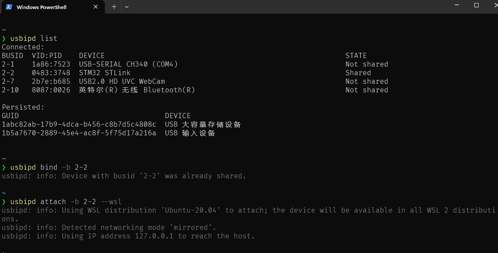
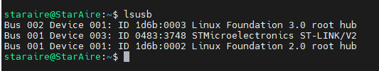
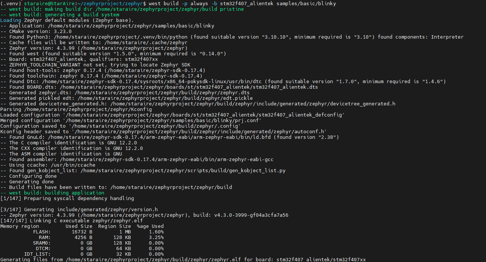

> 环境: `WSL2 ubuntu20.4`
> 开发板: 正点原子探索者`STM32F407`

<!-- more -->

## 搭建开发环境

> 参考官方文档<[Getting Started Guide](https://docs.zephyrproject.org/latest/develop/getting_started/index.html)>

### ubuntu安装工具包

```sh
sudo apt install --no-install-recommends git cmake ninja-build gperf \
  ccache dfu-util device-tree-compiler wget python3-dev python3-venv python3-tk \
  xz-utils file make gcc gcc-multilib g++-multilib libsdl2-dev libmagic1
```

- 补充安装`cmake`、`python`、`dtc`

> 这三个工具要满足版本要求, 否则后续操作会出错


官网版本要求

|Tool|Min. Version|
|---|---|
|[CMake](https://cmake.org/)|3.20.5|
|[Python](https://www.python.org/)|3.10|
|[Devicetree compiler](https://www.devicetree.org/)|1.4.6|

1、python：[Ubuntu20.04下更新系统Python版本_ubuntu20.04 python版本-CSDN博客](https://blog.csdn.net/weixin_45606191/article/details/129840222)  
2、cmake：[ubuntu 20.04安装(升级)cmake - 知乎](https://zhuanlan.zhihu.com/p/519732843)  


- 安装完验证

```sh
cmake --version
python3 --version
dtc --version
```


### 虚拟环境拉取源码和包 & 安装SDK

1、创建一个虚拟环境
```sh
python3 -m venv ~/zephyrproject/.venv
```
2、激活虚拟环境
```sh
source ~/zephyrproject/.venv/bin/activate
```
> ❗`python --version`再验证一下python的版本

3、安装管理zephyr的库工具west
```sh
pip install west
```
4、拉取`Zephyr`源代码
```sh
west init ~/zephyrproject
cd ~/zephyrproject
west update
```
5、导出`Zephyr`的包Package
```sh
west zephyr-export
```
6、安装`python`依赖
```sh
west packages pip --install
```
7、安装`SDK`
```sh
cd ~/zephyrproject/zephyr
west sdk install
```

### 安装USB透传工具 & ST-LINK下载工具

> 由于采用的是`ST-LINK`, 要在`WSL2`环境下载程序需要安装`stm32cubeprogrammer`  
> 同时还需要把`ST-LINK`透传到`WSL2`里

#### 安装USB透传工具

- 1、管理员打开`powershell`安装

```sh
winget install --interactive --exact dorssel.usbipd-win
```

- 2、插入ST-LINK, 终端依次输入

```sh
usbipd list // 查看usb列表
usbipd bind -b <bus_id> // 共享USB设备
usbipd attach -b <bus_id> --wsl // 共享到WSL里
```



- 3、打开`WSL2`，输入`lsusb`，能看到`stlink`即可



#### 安装ST-LINK下载工具

- 1、下载 `SetupSTM32CubeProgrammer-2.20.0.linux`
  - https://www.st.com/en/development-tools/stm32cubeprog.html

- 2、解压：unzip
- 3、执行安装脚本
  - `SetupSTM32CubeProgrammer-2.20.0.linux`
  - 出现交互界面，确认安装即可
- 4、添加环境目录
```sh
echo 'export PATH=$PATH:$HOME/STMicroelectronics/STM32Cube/STM32CubeProgrammer/bin' >> ~/.bashrc source ~/.bashrc
```

- 测试 `STM32_Programmer_CLI --version`


### 编译工程烧录测试

- 选择`stm32f4_disco`开发板编译`blinky`例程
  - `west build -p always -b stm32f4_disco samples/basic/blinky`
- 烧录`west flash`

> ❗如果usb无权限，可临时修改usb权限
`sudo chmod 666 /dev/bus/usb/001/003` # 根据你的设备路径调整


- 烧录成功即跑通, 接下来我们适配探索者开发板

## 适配正点原子探索者开发板

> 探索者开发板基于STM32F4, 所以我们找一个类似的开发板进行修改即可

打开`zephyr`源码路径下`boards/st`, 从`stm32f072b_disco`拷贝到新建文件夹`stm32f407_alientek`, 且将几个文件修改为和文件夹名一致, 参考下面


修改以下几个文件
- `board.cmake`
- `board.yml`
- `Kconfig.defconfig`
- `Kconfig.stm32f407_alientek`
- `stm32f407_alientek_defconfig`
- `stm32f407_alientek.dts`
- `stm32f407_alientek.yaml`

---

- `board.cmake`
```cmake
# SPDX-License-Identifier: Apache-2.0

# keep first
board_runner_args(stm32cubeprogrammer "--port=swd" "--reset-mode=hw")
board_runner_args(jlink "--device=STM32F407VG" "--speed=4000")

# keep first
include(${ZEPHYR_BASE}/boards/common/stm32cubeprogrammer.board.cmake)
include(${ZEPHYR_BASE}/boards/common/openocd-stm32.board.cmake)
include(${ZEPHYR_BASE}/boards/common/jlink.board.cmake)
include(${ZEPHYR_BASE}/boards/common/stlink_gdbserver.board.cmake)
```

- `board.yml`
```yml
board:
  name: stm32f407_alientek
  full_name: STM32F407 ALIENTEK
  vendor: st
  socs:
    - name: stm32f407xx

```

- `Kconfig.defconfig`
```
# STM32F072B-DISCO board configuration

# Copyright (c) 2017 Clage GmbH
# SPDX-License-Identifier: Apache-2.0

if BOARD_STM32F4_ALIENTEK

endif # 
```

- `Kconfig.stm32f407_alientek`
```
# Copyright (c) 2016 Linaro Limited.
# SPDX-License-Identifier: Apache-2.0

config BOARD_STM32F407_ALIENTEK
	select SOC_STM32F407XG

```

- `stm32f407_alientek_defconfig`
```
# SPDX-License-Identifier: Apache-2.0

# Enable MPU
CONFIG_ARM_MPU=n


# Enable HW stack protection
CONFIG_HW_STACK_PROTECTION=n

CONFIG_SERIAL=y

# console
CONFIG_CONSOLE=y
CONFIG_UART_CONSOLE=y

# enable GPIO
CONFIG_GPIO=y

```

- `stm32f407_alientek.dts`

> 拷贝`boards/st/stm32f4_disco`底下的`stm32f4_disco.dts`

修改`led0`映射的`green_led_4`, 探索者的LED0接的是PF9引脚, 低电平使能
```dts
		green_led_4: led_4 {
			gpios = <&gpiof 9 GPIO_ACTIVE_LOW>;
			label = "User LD4";
		};

```

修改设备树里的外部时钟和系统时钟, HSE时钟晶振为`25M`

```dts
&clk_hse {
	clock-frequency = <DT_FREQ_M(25)>;
	status = "okay";
};

&rcc {
	clocks = <&pll>;
	clock-frequency = <DT_FREQ_M(168)>;
	ahb-prescaler = <1>;
	apb1-prescaler = <4>;
	apb2-prescaler = <2>;
};

```

修改锁相环PLL参数

```dts
&pll {
	div-m = <25>;
	mul-n = <336>;
	div-p = <2>;
	div-q = <7>;
	clocks = <&clk_hse>;
	status = "okay";
};
```


- `stm32f407_alientek.yaml`

```yml
identifier: stm32f407_alientek
name: ST STM32F4 ALIENTEK
type: mcu
arch: arm
toolchain:
  - zephyr
  - gnuarmemb
ram: 128
flash: 1024
supported:
  - can
  - pwm
  - counter
  - adc
vendor: st

```

修改完之后进行编译

```sh
west build -p always -b stm32f407_alientek samples/basic/blinky
```



烧录

```sh
west flash
```


观察开发板灯闪烁


## 📌参考资料

- [zephyr官方文档](https://docs.zephyrproject.org/latest/)


