# 第一部分 CPU基本电路的实现


> 本文是对B站UP[踌躇月光](https://space.bilibili.com/491131440)出的[8位二进制CPU的设计和实现](https://www.bilibili.com/video/BV1aP4y1s7Vf)的文字教程复现第一部分 CPU基本电路的实现
相关 github 地址：https://github.com/StevenBaby/computer
PS：有错误的地方请指正，谢谢！共同学习，一起进步！

## 概述

> 这个视频主要是分享8位二进制CPU的设计和实现。
首先，解释一下为什么做这个视频。众所周知，计算机专业众多课程中有一门课是计算机组成原理，这门课程实际上并不那么好理解，因为他涉及到了硬件。但是组成原理这门课又没有对硬件部分做充分的描述，导致这门课没有其他课那么容易学习，特别是中央处理器(CPU)部分的实现。那么我们一起来实现一个8位二进制CPU，就可以更加自然的理解计算机组成原理究竟说了些什么。
其次，关于做CPU或者说做一台计算机，做一台什么样的计算机的问题，图灵(1912-1954)给出过答案，图灵在他的论文`<可计算性>`中给出了什么样的事情是计算机可以做的，什么是做不到的，以及给出了计算机的抽象模型-图灵机，其中就描述了计算机和机器的区别，区别就是支持任何条件转移指令的机器就是计算机，也就是说我们要做一个支持条件转移的计算机，在这篇论文中还介绍了另一种测试计算机的方法，这就是人们熟知的图灵测试。最早引入条件转移指令的人是英国数学家和经济学家查尔斯.巴贝奇(1792-1871)，大约在19世纪，巴贝奇就有了制造解析机的想法，不过巴贝奇的解析机并没有在他有生之年实现。那么我们要做的CPU就是可以支持条件转移指令的机器，这里推荐大家两本书，一本是查尔斯的[《编码：隐匿在计算机软硬件背后的语言》](https://www.jb51.net/books/232230.html)，也是这本书让up有了想做此视频的想法，第二本是李忠的[《穿越计算机的迷雾》](https://www.jb51.net/books/101429.html)，可以作为前一本书的补充，值得大家一读再读。以上两本就作为教材了，如果想尽快了解做什么，可以去下载这两本书先读一读。工欲善其事必先利其器，本教程使用一个电路仿真的软件`logiccircuit`(下面会提到)来制作CPU电路。


## 准备工作

- 小白可以看看上面的两本书的前面部分或者快速入门数电基础

- 下载仿真软件`logiccircuit`：[下载地址](https://www.logiccircuit.org/download.html)


## `logiccircuit`软件使用方法

打开软件，主窗口由以下几个部分组成

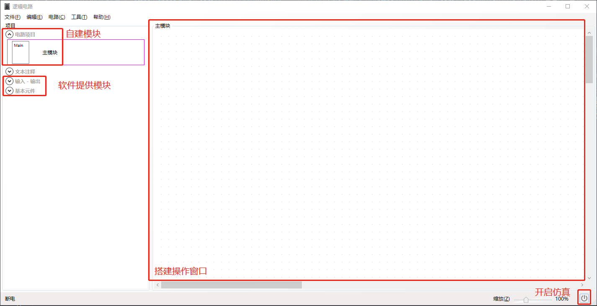

- `软件提供模块`：软件自身提供的一些基本输入输出单元和基本模块
- `自建模块`：通过下面的软件提供模块搭建的特殊功能模块
- `搭建操作窗口`：拖动模块连线和仿真展示的窗口
- `开启仿真按钮`：模块搭建和连线之后开启仿真的按钮

### 输入输出单元

- **输入单元**
    - `位宽`：可选位宽如1位，8位
    - `边`：搭建模块时选择接口位置
- **输出单元**
    - `位宽`：可选位宽如1位，8位
    - `边`：搭建模块时选择接口位置
- **按钮/切换器**
    - `符号`：名字是模块内部用的，特别是展示真值表时显示。符号是模块上表示该引脚的一个代号。
    - `切换器`：切换器是锁定状态的，和按钮不同，按钮按下是一个状态，弹开是一个状态，切换器每按下弹起一次切换一次状态
    - `针脚`：和边类似，搭建模块时选择接口位置
- **常量**：和输入单元差不多，只不过是常量
- **传感器**：暂时不涉及
- **时钟**：提供时钟信号
- **分路器**：用来合并分路针脚为总线
    - `分路针脚数目`：引脚多的一端的针脚数
    - `分路针脚位宽`：引脚多的一端的单个针脚的位宽
    - `组合针脚位置`：单总线的位宽=分路针脚数目x分路针脚位宽，位置决定是输入还是输出，有`三角标志`的是`低位`
- **LED**：方便显示逻辑电平输出，1 亮 0灭
- **7段数码管**：显示数字
- **LED矩阵**
- **图形序列**
- **蜂鸣器**
- **探针**：方便看某一处的电平输出

### 基本元件

- **非门**
    - `逻辑表达式`：$L=\overline{A}$
    - `真值表`
    |  A  |  L  |
    | --- | --- |
    | 0   | 1   |
    | 1   | 0   |


- **三态门(上)**
- **三态门(下)**
- **与门**
    - `逻辑表达式`：$L=A\cdot B=AB$
    - `真值表`
    |  A  |  B  |  L  |
    | --- | --- | --- |
    | 0   | 0   | 0   |
    | 0   | 1   | 0   |
    | 1   | 0   | 0   |
    | 1   | 1   | 1   |
- **与非门**
    - `逻辑表达式`：$L=\overline{A\cdot B}=\overline{AB}$
    - `真值表`
    |  A  |  B  |  L  |
    | --- | --- | --- |
    | 0   | 0   | 1   |
    | 0   | 1   | 1   |
    | 1   | 0   | 1   |
    | 1   | 1   | 0   |
- **或门**
    - `逻辑表达式`：$L=A + B$
    - `真值表`
    |  A  |  B  |  L  |
    | --- | --- | --- |
    | 0   | 0   | 0   |
    | 0   | 1   | 1   |
    | 1   | 0   | 1   |
    | 1   | 1   | 1   |
- **或非门**
    - `逻辑表达式`：$L=\overline{A + B}$
    - `真值表`
    |  A  |  B  |  L  |
    | --- | --- | --- |
    | 0   | 0   | 1   |
    | 0   | 1   | 0   |
    | 1   | 0   | 0   |
    | 1   | 1   | 0   |
- **异或门** 
    - `逻辑表达式`：$L=A\overline{B} + \overline{A}B$
    - `真值表`
    |  A  |  B  |  L  |
    | --- | --- | --- |
    | 0   | 0   | 0   |
    | 0   | 1   | 1   |
    | 1   | 0   | 1   |
    | 1   | 1   | 0   |
- **同或门**
    - `逻辑表达式`：$L=\overline{A} \overline{B} + AB$
    - `真值表`
    |  A  |  B  |  L  |
    | --- | --- | --- |
    | 0   | 0   | 1   |
    | 0   | 1   | 0   |
    | 1   | 0   | 0   |
    | 1   | 1   | 1   |
- ROM：只读存储器
- RAM：随机存储器

真值表：选中自建模块后，确保有输入输出单元，然后点击菜单栏`电路`-`真值表`，即可查看该模块的真值表


### 操作方法

总结的一些操作方法，有的可以在遇到了再回来看看

- ***新建模块***
    点击菜单栏`电路`-`新建逻辑电路`，即可新建模块
- ***修改自建模块名称***
    选中模块，点击菜单栏`电路`-`逻辑电路`，即可修改名字，符号，类别
- ***交叉线的画法***
    按住`Alt`，点击交叉点
- ***旋转元器件***
    `ctrl+L`


## 基本逻辑电路


### 半加器 Half Adder

***参考工程：[03 半加器](https://github.com/StevenBaby/computer/tree/main/cpu/03%20%E5%8D%8A%E5%8A%A0%E5%99%A8)***

单位二进制加法：`0 + 0 = 0(无进位)`、`0 + 1 = 1(无进位)`、`1 + 0 = 1(无进位)`、`1 + 1 = 0(进位1)`

写成真值表(A,B输入，S输出，C进位输出)为

|  A  |  B  |  S  |  C  |
| --- | --- | --- | --- |
| 0   | 0   | 0   | 0   |
| 0   | 1   | 1   | 0   |
| 1   | 0   | 1   | 0   |
| 1   | 1   | 0   | 1   |

实现这样一个运算的逻辑电路称为`半加器`

> `半加器`电路是指对两个输入数据`位相加`，输出一个`结果位`和`进位`，`没有进位输入`的加法器电路。 是实现两个`一位二进制数`的`加法运算电路`。

根据经验我们得知，逻辑表达式为

$$
\begin{aligned}
S=\overline{A}B+A\overline{B} = A\oplus B\\
C=AB
\end{aligned}$$


打开`logiccircuit`根据上面异或和与关系搭建门电路，验证
- ***将`异或(XOR)门`用`与`、`或`、`非`门实现出来***
    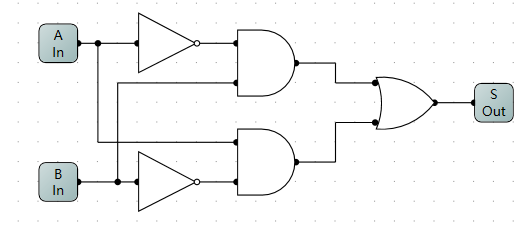


- ***然后用`异或(XOR)门`和`与门`共同搭建`半加器(Half Adder)`***
    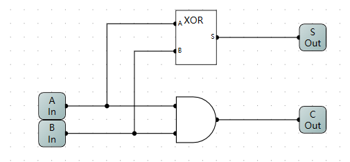


- ***搭建完之后通过`按键`和`LED`测试，符合真值表逻辑即可***
    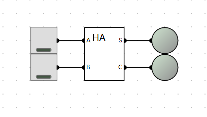


### 全加器 Full Adder 和加法器 8Adder

***参考工程：[04 全加器和加法器](https://github.com/StevenBaby/computer/tree/main/cpu/04%20%E5%85%A8%E5%8A%A0%E5%99%A8%E5%92%8C%E5%8A%A0%E6%B3%95%E5%99%A8)***

#### 全加器 Full Adder

> 全加器英语名称为`Full Adder`，是用门电路实现`两个二进制数相加`并求出和的组合线路，称为`一位全加器`。一位全加器可以处理低位`进位`，并输出本位加法进位。    

将上面真值表补齐(`CI`是输入低位进位)

|  A  |  B  | CI  |  S  | CO  |
| --- | --- | --- | --- | --- |
| 0   | 0   | 0   | 0   | 0   |
| 0   | 0   | 1   | 1   | 0   |
| 0   | 1   | 0   | 1   | 0   |
| 0   | 1   | 1   | 0   | 1   |
| 1   | 0   | 0   | 1   | 0   |
| 1   | 0   | 1   | 0   | 1   |
| 1   | 1   | 0   | 0   | 1   |
| 1   | 1   | 1   | 1   | 1   |


- ***通过两个`半加器`设计`全加器`***
    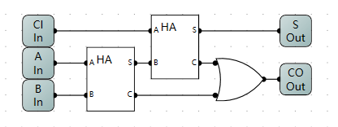

- ***搭建完之后通过`按键`和`LED`测试，符合真值表逻辑即可***
    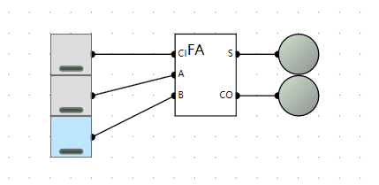

> 补充：也可以通过ROM存储器地址映射的方式实现全加器
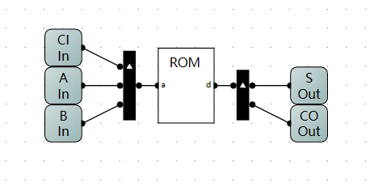


将`CI`、`A`、`B`当做地址的三位，`S(低位)`、`CO`当做数据的两位，填入
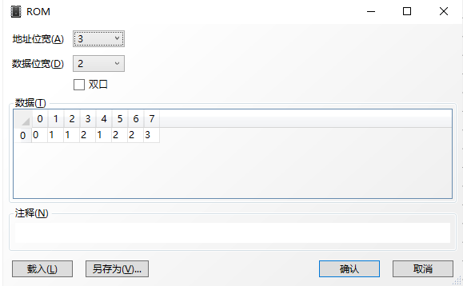

也可以实现全加器的功能。

#### 8位加法器 8Adder

- ***将8个`全加器`级联***
    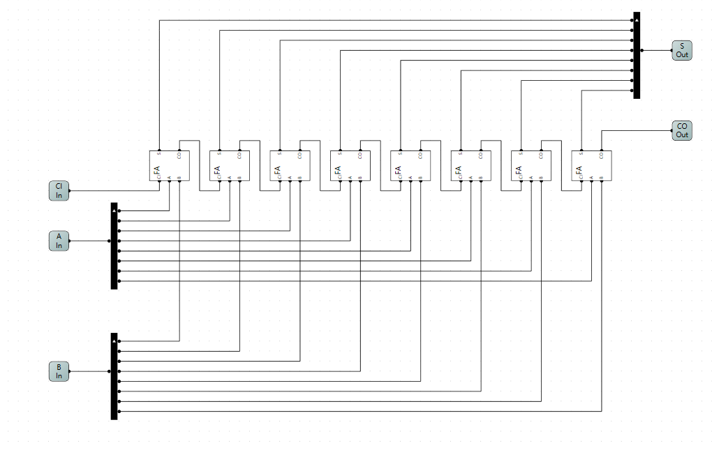


- ***制作测试器测试***
    - 8位开关
        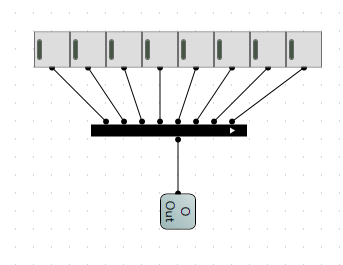
    - 8位LED
        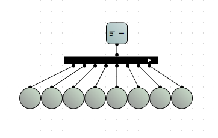


将其组合在一起测试
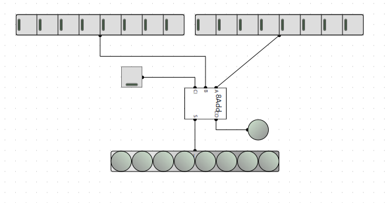


> 补充：这种全加器叫`串形加法器`，由于高位的运算需要等待低位的进位输出，所以会有延迟，效率不是很高。
还有一种[并行加法器](https://baike.baidu.com/item/%E5%B9%B6%E8%A1%8C%E5%8A%A0%E6%B3%95%E5%99%A8)可以实现同步，这里不多做介绍。事实上还可以通过前面的ROM实现方法实现低延迟运算。


### 补码和减法

***参考工程：[05 补码与减法](https://github.com/StevenBaby/computer/tree/main/cpu/05%20%E8%A1%A5%E7%A0%81%E4%B8%8E%E5%87%8F%E6%B3%95)***

> 关于补码：因为计算机采用的二进制，没有符号位的概念，因此没法实现减法操作，所以诞生出了补码的概念。
这里拿时钟举例，时钟有12点，`12=0`，`1+11=0`，`1-1=0`，所以`1的补码`就是`11`，`1减去1`就是`1加上1的补码(11)`

> 在二进制中，一个二进制数的补码即为该二进制数的反码+1，反码则是每一位都取反，例如`0001`的**反码**为`1110`，**补码**为`1111`

#### 取反器 Invert

- ***一位取反器*** 

其实就是非门，只不过加上一位使能位E

|  E  |  I  |  O  |
| --- | --- | --- |
| 0   | 0   | 0   |
| 0   | 1   | 1   |
| 1   | 0   | 1   |
| 1   | 1   | 0   |

根据以上真值表，采用`异或门`

- ***8位取反器***

将八个`取反器`并联

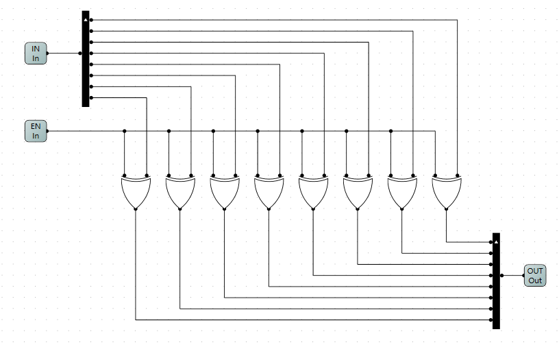


#### 减法运算

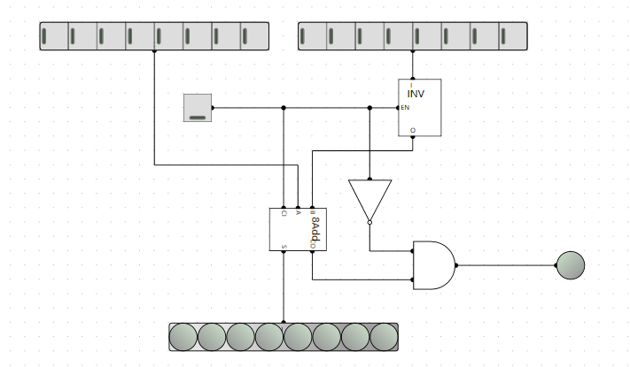


- 按键实现了`取反`和`+1`的操作
- `与门`和`非门`是为了在减法运算时屏蔽最高位的进位。


### 数码管和译码电路设计


#### 数码管简介

> 数码管本质上就是LED，不同的位控制不同的LED，如下图，从第0位到第7位，通过控制不同的LED来组合出数字。

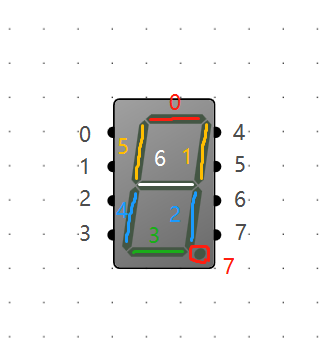

通过以下电路测试一下

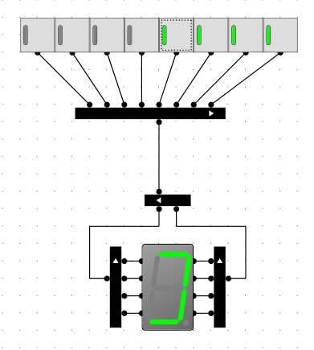


#### 七段十六进制数码管

***参考工程：[06 七段十六进制进制数码管的制作](https://github.com/StevenBaby/computer/tree/main/cpu/06%20%E4%B8%83%E6%AE%B5%E5%8D%81%E5%85%AD%E8%BF%9B%E5%88%B6%E8%BF%9B%E5%88%B6%E6%95%B0%E7%A0%81%E7%AE%A1%E7%9A%84%E5%88%B6%E4%BD%9C)***


> 通过四位二进制输入显示`0~F`十六个数码符号

| A3  | A2  | A1  | A0  | number |
| --- | --- | --- | --- | -------- |
| 0   | 0   | 0   | 0   | `0`     |
| 0   | 0   | 0   | 1   | `1`     |
| 0   | 0   | 1   | 0   | `2`     |
| 0   | 0   | 1   | 1   | `3`     |
| 0   | 1   | 0   | 0   | `4`     |
| 0   | 1   | 0   | 1   | `5`     |
| 0   | 1   | 1   | 0   | `6`     |
| 0   | 1   | 1   | 1   | `7`     |
| 1   | 0   | 0   | 0   | `8`     |
| 1   | 0   | 0   | 1   | `9`     |
| 1   | 0   | 1   | 0   | `A`     |
| 1   | 0   | 1   | 1   | `b`     |
| 1   | 1   | 0   | 0   | `C`     |
| 1   | 1   | 0   | 1   | `d`     |
| 1   | 1   | 1   | 0   | `E`     |
| 1   | 1   | 1   | 1   | `F`     |

以上也叫段码表


##### 单十六进制数码管译码电路

阳极段码表

| A3  | A2  | A1  | A0  | number |  HEX  |
| --- | --- | --- | --- | -------- | ------ |
| 0   | 0   | 0   | 0   | `0`     | 0x3F |
| 0   | 0   | 0   | 1   | `1`     | 0x06 |
| 0   | 0   | 1   | 0   | `2`     | 0x5B |
| 0   | 0   | 1   | 1   | `3`     | 0x4F |
| 0   | 1   | 0   | 0   | `4`     | 0x66 |
| 0   | 1   | 0   | 1   | `5`     | 0x6D |
| 0   | 1   | 1   | 0   | `6`     | 0x7D |
| 0   | 1   | 1   | 1   | `7`     | 0x07 |
| 1   | 0   | 0   | 0   | `8`     | 0x7F |
| 1   | 0   | 0   | 1   | `9`     | 0x6F |
| 1   | 0   | 1   | 0   | `A`     | 0x77 |
| 1   | 0   | 1   | 1   | `b`     | 0x7C |
| 1   | 1   | 0   | 0   | `C`     | 0x39 |
| 1   | 1   | 0   | 1   | `d`     | 0x5E |
| 1   | 1   | 1   | 0   | `E`     | 0x79 |
| 1   | 1   | 1   | 1   | `F`     | 0x71 |


- ***采用ROM映射`4路地址线`到8个数据上***

将上述数字填入ROM的存储单元中

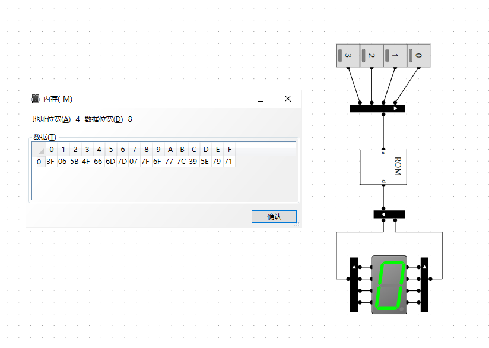


将按键换成输入即模块的制作


##### 双十六进制数码管译码电路

- ***将两个单十六进制数码管并联，即可制作双十六进制数码管***
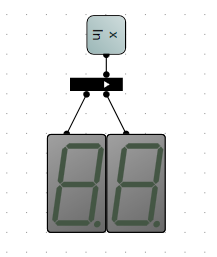


- ***将双数码管放到之前制作的加法器中，即可测试数码管***
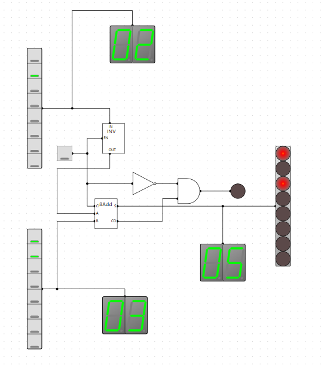


#### 七段十进制数码管

***参考工程：[07 七段十进制进制数码管的制作](https://github.com/StevenBaby/computer/tree/main/cpu/07%20%E4%B8%83%E6%AE%B5%E5%8D%81%E8%BF%9B%E5%88%B6%E8%BF%9B%E5%88%B6%E6%95%B0%E7%A0%81%E7%AE%A1%E7%9A%84%E5%88%B6%E4%BD%9C)***

- ***同理，向ROM中写入固定数据***
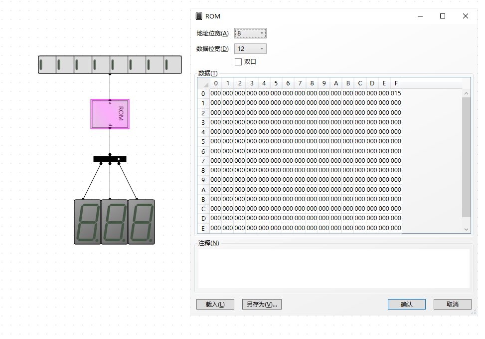


- ***点击`另存为`，将二进制文件保存到桌面，用`vscode`打开(下载插件`Hex Editor`)***

这里我已经写入了数据
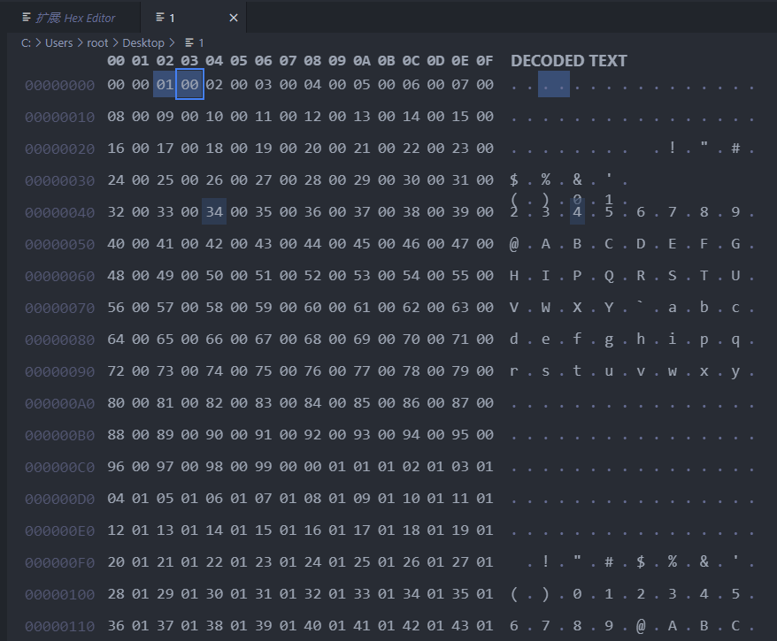


- ***通过Python脚本写入数据***

```py
import os
dirname = os.path.dirname(os.path.abspath(__file__))
with open(os.path.join(dirname,'test.bin'),'wb') as file:
    for var in range(256):
        var=str(var)
        var=int(var,base=16)
        byte = var.to_bytes(2,byteorder='little')
        file.write(byte)
```

- ***然后将二进制文件载入***
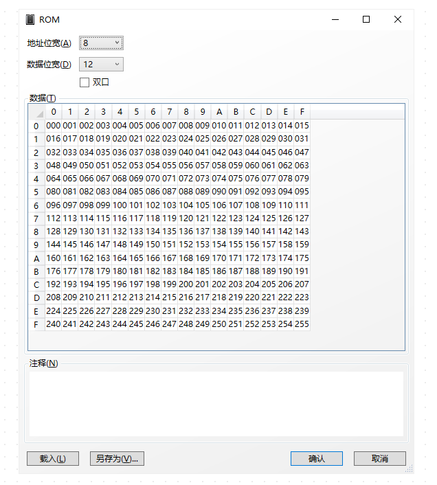


#### 数码管高位消隐

> 要想让高位为零时不亮，可以考虑先给单个数码管加一个使能位。

> 解决思路就是做一个8位的二选一选择器

##### 单位二选一选择器
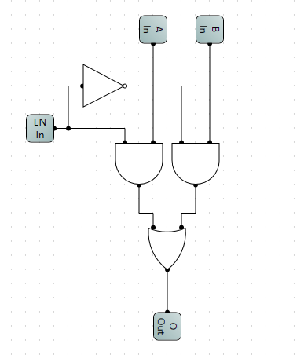

当EN为0时，输出等于B，与A无关
当EN为1时，输出等于A，与B无关


##### 八位二选一选择器
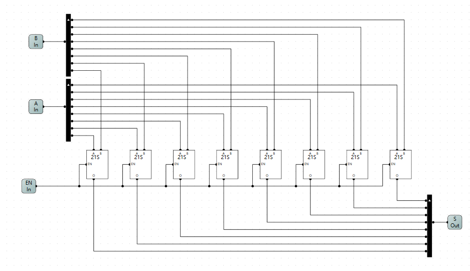


8个二选一选择器并联


##### 数码管使能

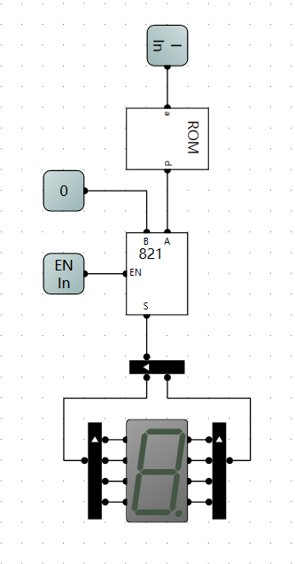


如果EN为1，则数码管使能，如果EN为0，则数码管熄灭

##### 消隐电路实现


- ***十六进制(双数码管)***

> 将高位的输入接入通过或门接入使能端，当全为0时，EN为0，数码管熄灭
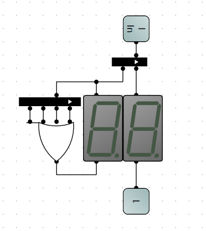


- ***十进制(三数码管)***

> 同理，将两个高位的输入用或门接入使能端，同时，防止出现例如`208`时中间的零被消隐掉，中间一位的或门需要加入最高位。
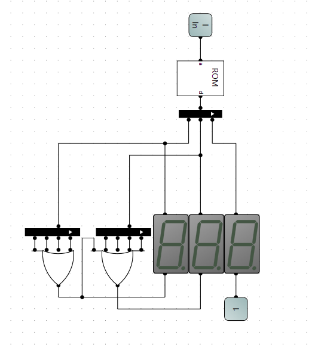


再放到原来的电路中测试一下
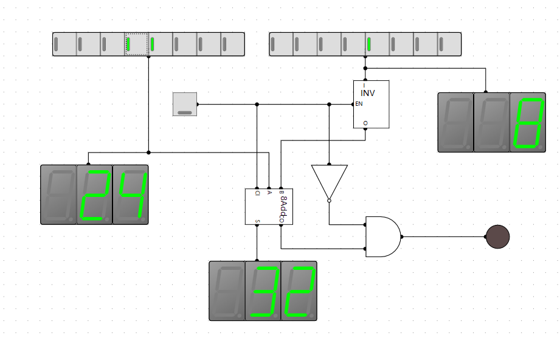


> 前面一部分都是组合逻辑电路部分，现在开始时序逻辑电路部分，区别在于，时序逻辑电路能够保存电路状态。

### RS触发器

***参考工程：[08 R-S触发器](https://github.com/StevenBaby/computer/tree/main/cpu/08%20R-S%E8%A7%A6%E5%8F%91%E5%99%A8)***

我们先看一下RS触发器的真值表

|  R  |  S  |   Q    |  Q'   |
| :-: | :-: | :----: | :----: |
|  0  |  0  | 不变 | 不变 |
|  0  |  1  |   1    |   0    |
|  1  |  0  |   0    |   1    |
|  1  |  1  |   0    |   0    |

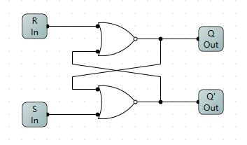


该电路有以下特点：
- 刚上电时，输出的状态是不确定的，只确定两个输出是相反的。
- 当其中一个输出为1时，输出状态立刻确定，见上面真值表。
- 当两个输出都为0时，输出状态保持不变。
- 当两个输出都为1时，输出都为0，则无法通过单个输出判断状态，此时触发器状态不确定(应避免此情况)。

该电路主要作用在于：如果R和S都为0时，电路状态可以得到保存，这个功能也叫作锁存器。


### D触发器

***参考工程：[09 D 触发器](https://github.com/StevenBaby/computer/tree/main/cpu/09%20D%20%E8%A7%A6%E5%8F%91%E5%99%A8)***

> 抛弃掉RS的锁存功能，R和S总是相反的，将D接到S端，D取反接到R端，两个输入合成一个输入，就构成了D触发器。

> 再添加一个EN，作为锁存功能(这样做的目的是方便对锁存功能进行统一管理)。具体实现如下：

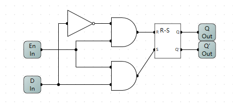


### D边沿触发器

***参考工程：[10 D 边沿触发器](https://github.com/StevenBaby/computer/tree/main/cpu/10%20D%20%E8%BE%B9%E6%B2%BF%E8%A7%A6%E5%8F%91%E5%99%A8)***

> 上升沿触发器：En上升沿的时候，D数据才会 写到Q


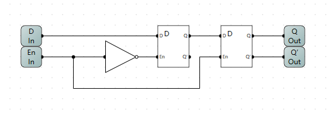


> 这样做的目的是在时钟信号输入时，只对上升沿信号做出动作(LED亮)，忽略下降沿信号，这样，时钟信号一个周期完成一个动作。


#### 解决初始状态问题

> 上面的不管是RS触发器还是D触发器还是D边沿触发器，都存在刚上电时状态不确定的情况，因此，需要添加设置其初始状态的功能。

- ***RS触发器***
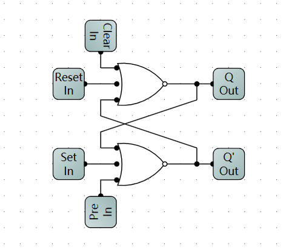

- ***D触发器***
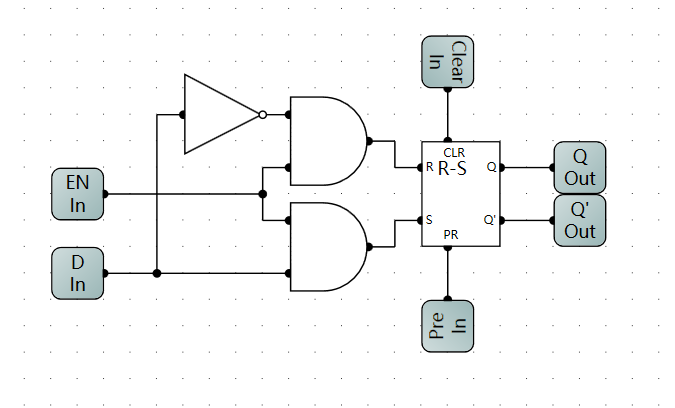


- ***D边沿触发器***
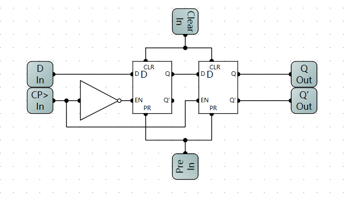


#### D边沿触发器的应用

> 上面说到D边沿触发器可以让时钟信号一个周期完成一个动作。见下面一个应用电路：

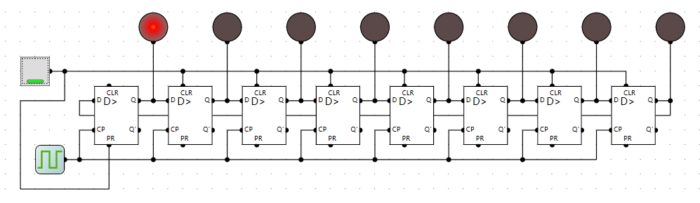


- 首先，上电，按下按钮，完成给第一个D边沿触发器置1，其他清0的动作(如上，第一个LED亮)
- 松开按钮之后，第一个输出=第二个输入为1，其他输入为0，时钟信号一个周期将所有输入写入到输出，此时变第一个输出为1为第二个输出为1=第三个输入为1，其他为0，这样一个周期，LED进行一次位移，形成跑马灯的效果。


### T触发器和行波计数器

***参考工程：[11 T 触发器和行波计数器](https://github.com/StevenBaby/computer/tree/main/cpu/11%20T%20%E8%A7%A6%E5%8F%91%E5%99%A8%E5%92%8C%E8%A1%8C%E6%B3%A2%E8%AE%A1%E6%95%B0%E5%99%A8)***

> T触发器的T的意思是Toggle，即翻转，如果说D边沿触发器是一个周期做一个动作，T触发器就是一个周期翻转一次状态(具体的动作)，原理就是把输出的非再接入到输入。

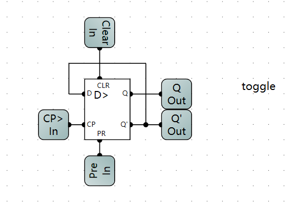


#### T触发器的应用-行波计数器

> 上面说到，T触发器一个周期完成一次翻转，两次翻转即构成输出的一次周期。见下面的电路


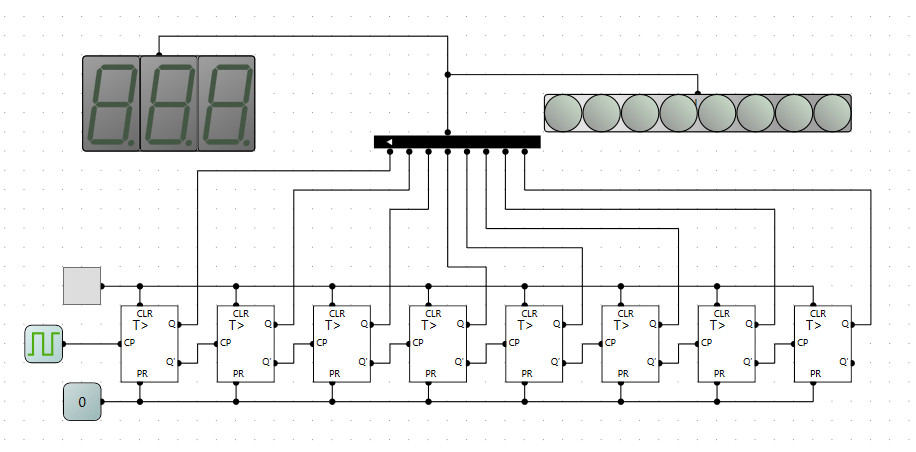


第一个T触发器的两个周期构成第二个T触发器的一个周期，第二个T触发器的两个周期构成第三个T触发器的一个周期，依次类推。即构成了一个8位计数器，从0到255。


### 三态门和寄存器

***参考工程：[12 三态门和寄存器](https://github.com/StevenBaby/computer/tree/main/cpu/12%20%E4%B8%89%E6%80%81%E9%97%A8%E5%92%8C%E5%AF%84%E5%AD%98%E5%99%A8)***

> 上面提到的D边沿触发器可以在上升沿中将输入写入输出，利用这样的功能我们可以实现一个`单字节存储器`。

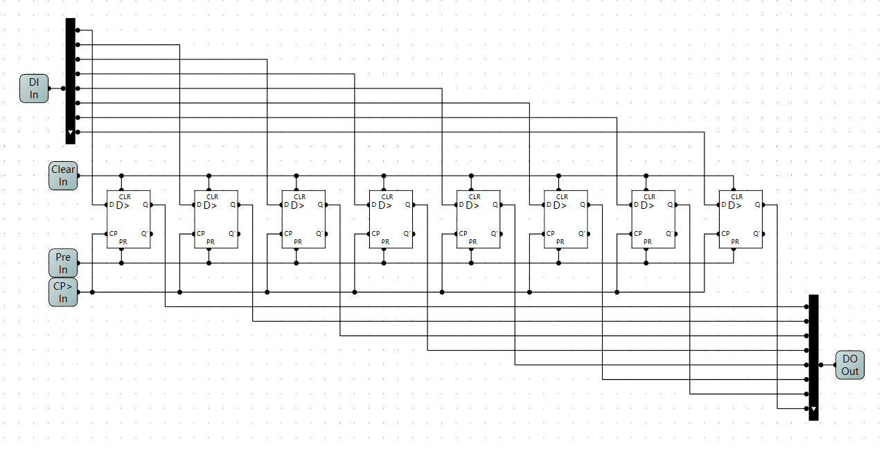


功能：通过Clear清0 ，Pre置1，在DI端输入8位数据，给CP一个上升沿，DI数据就被写入到DO上

问题：
总线冲突问题：如果将多个`存储器`连到一起做数据交换，那么就会存在一个输入会连到多个输出的问题，就会发生数据冲突，那么有没有办法在需要数据交换时将两个寄存器单独连接在一起。这个办法就是三态门。

#### 三态门

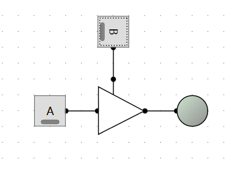


三态门的作用就是当B失能时，输入与输出处于断开状态(高阻态)，当B使能时，输入与输出处于连接状态。

将八个三态门并联得到八位三态门电路

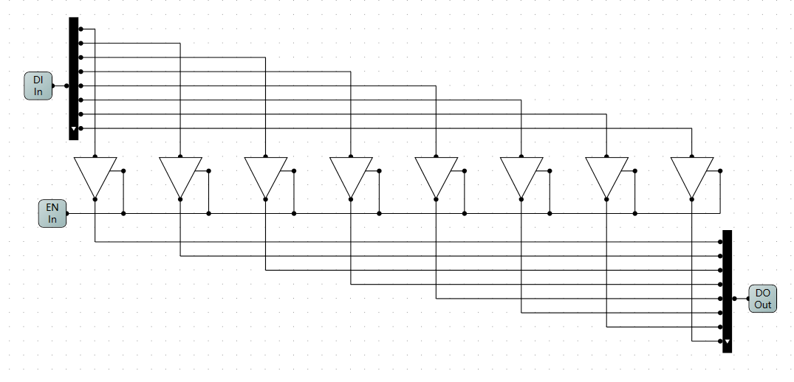

这样我们就可以解决上面说的总线冲突问题

#### 寄存器

> `存储器`加上`三态门`可以构成`寄存器`

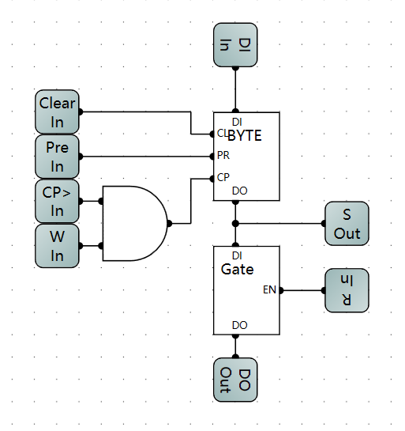

- 端口S仅做比较有三态门和无三态门时的区别，实际并无此端口
- 当W使能时，和时钟信号一起作用，可以将存储器输入写到存储器输出
- 当R使能时，三态门连通，存储器输出连到寄存器输出；当R不使能时，寄存器输出处于高阻态。

R没有使能

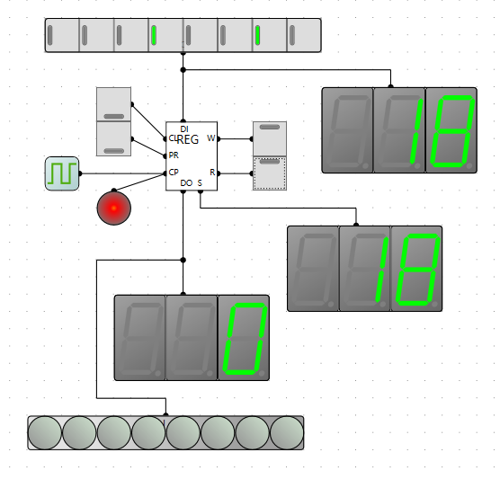


R使能后

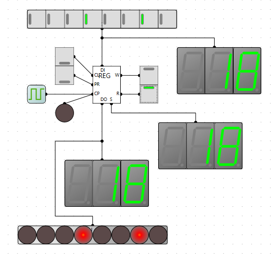


### 三八译码器和存储器组织

***参考工程：[13 三八译码器和存储器组织](https://github.com/StevenBaby/computer/tree/main/cpu/13%20%E4%B8%89%E5%85%AB%E8%AF%91%E7%A0%81%E5%99%A8%E5%92%8C%E5%AD%98%E5%82%A8%E5%99%A8%E7%BB%84%E7%BB%87)***

#### 三八译码器

> 三八译码器，顾名思义，就是三位向八位的一个译码器，其真值表如下：

| A2 | A1 | A0 | O7 | O6 | O5 | O4 | O3 | O2 | O1 | O0 |
| --- | --- | --- | --- | --- | --- | --- | --- | --- | --- | --- |
| 0   | 0   | 0   |     |     |     |     |     |     |     | 1   |
| 0   | 0   | 1   |     |     |     |     |     |     | 1   |     |
| 0   | 1   | 0   |     |     |     |     |     | 1   |     |     |
| 0   | 1   | 1   |     |     |     |     | 1   |     |     |     |
| 1   | 0   | 0   |     |     |     | 1   |     |     |     |     |
| 1   | 0   | 1   |     |     | 1   |     |     |     |     |     |
| 1   | 1   | 0   |     | 1   |     |     |     |     |     |     |
| 1   | 1   | 1   | 1   |     |     |     |     |     |     |     |

逻辑电路

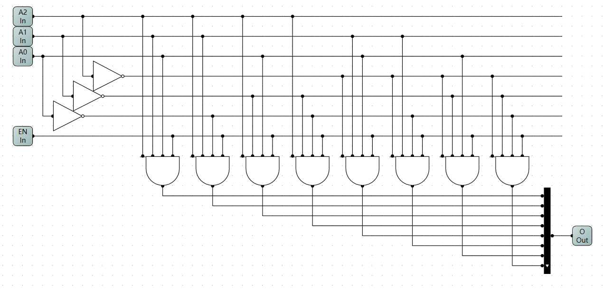


#### 存储器

> 前面我们实现了一个1byte的存储器，或者说寄存器，现在我们要实现一个8byte寄存器，基本思路就是用一个三八译码器实现三位地址线对8个1byte存储器的选择。

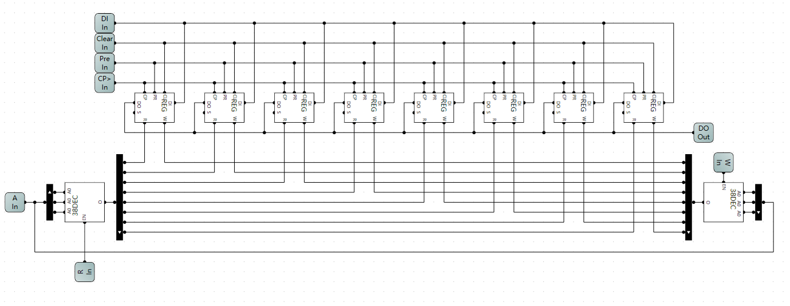

- ***测试读写功能***

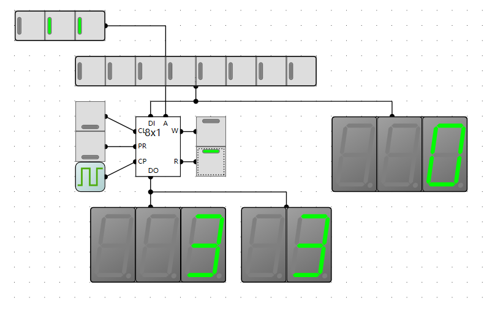


### 存储器扩展和读写


***参考工程：[14 存储器扩展](https://github.com/StevenBaby/computer/tree/main/cpu/14%20%E5%AD%98%E5%82%A8%E5%99%A8%E6%89%A9%E5%B1%95)、[15 关于存储器读写的问题](https://github.com/StevenBaby/computer/tree/main/cpu/15%20%E5%85%B3%E4%BA%8E%E5%AD%98%E5%82%A8%E5%99%A8%E8%AF%BB%E5%86%99%E7%9A%84%E9%97%AE%E9%A2%98)***


#### 存储器扩展

> 存储器扩展分为`字扩展`和`位扩展`

> 这里首先谈一下`位扩展`，例如前面是8x1byte存储器，现在扩展为8x2byte存储器，只要将输入输出的位扩宽即可

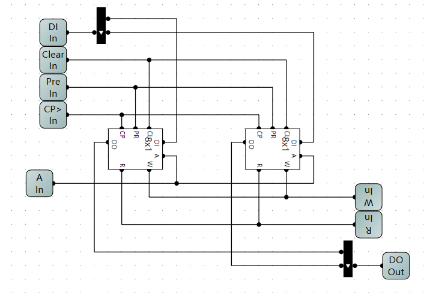

> 其次是`字扩展`，例如前面是8x1byte存储器，现在扩展为16x1byte存储器，扩宽一位地址线(加一个二选一)即可

- ***加宽高位地址线***
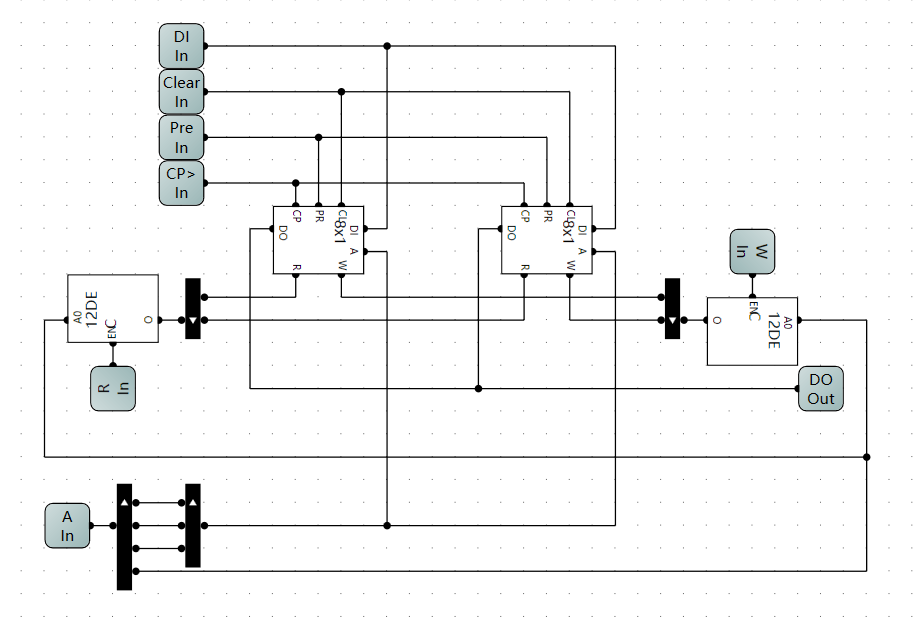


- ***加宽低位地址线***
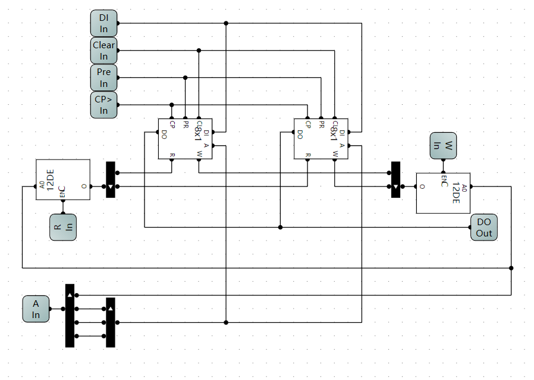

#### 存储器读写问题

> 这里存储器的读和写是独立开来的，这样会在某些时刻造成冲突，所以要解决这个问题，就是让存储器在写的时候没法读。做出以下修改：

- 单字节存储器
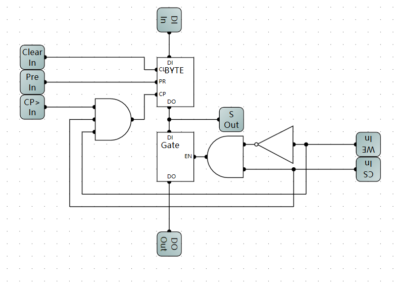


- 8x1byte存储器
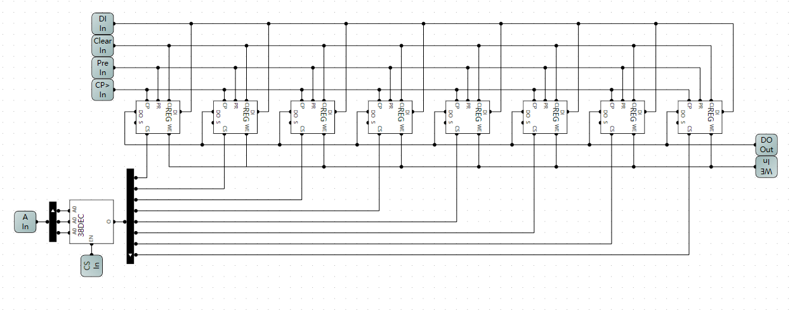

- 8x2byte存储器
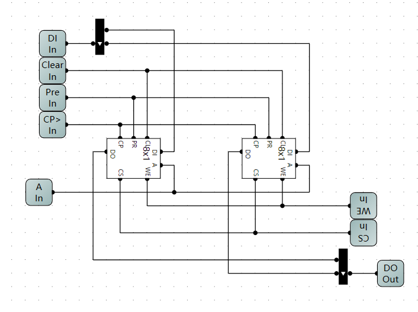

- 16x1byteH存储器
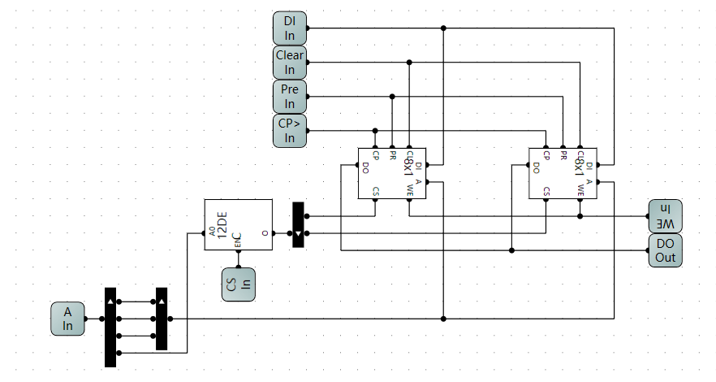
- 16x1byteL存储器
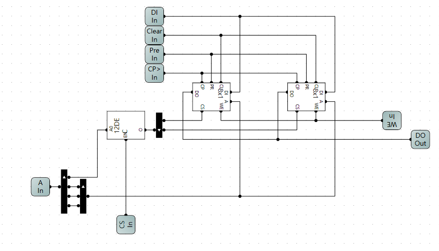
