# 第二部分 CPU微机架构的实现

> 本文是对B站UP[踌躇月光](https://space.bilibili.com/491131440)出的[8位二进制CPU的设计和实现](https://www.bilibili.com/video/BV1aP4y1s7Vf)的文字教程复现第二部分 CPU微机架构的实现
相关 github 地址：https://github.com/StevenBaby/computer
PS：有错误的地方请指正，谢谢！共同学习，一起进步！


## ALU和半自动加法机

***参考工程：[16 ALU和半自动加法机](https://github.com/StevenBaby/computer/tree/main/cpu/16%20ALU%E5%92%8C%E5%8D%8A%E8%87%AA%E5%8A%A8%E5%8A%A0%E6%B3%95%E6%9C%BA)***

> 回顾第一部分做的加法运算器，封装一下即得到`ALU`(算术逻辑单元(arithmetic and logic unit))

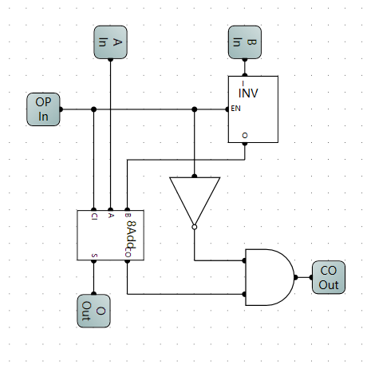

- A,B是两个8位数输入，做相加运算用
- OP是选择做加法还是减法，为1时做减法，为0时做加法
- O是相加输出，CO是进位输出

### 半自动加法机

> 通过`ALU`和`三位计数器`、`ROM`、`寄存器`我们可以组成一个半自动加法器，如下所示

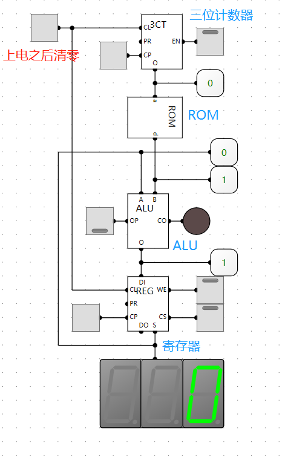

其中

- 三位计数器用来遍历ROM里所有地址的数据
- ALU负责做加法运算
- 寄存器暂存加法运算后的数据
 

计算步骤

- 上电之后，点击左上角按键，计数器和寄存器都被置为0。接着我们打开计数器使能，寄存器写使能，给寄存器一个时钟信号，将ROM里0地址的数写到加法器的A输入口。
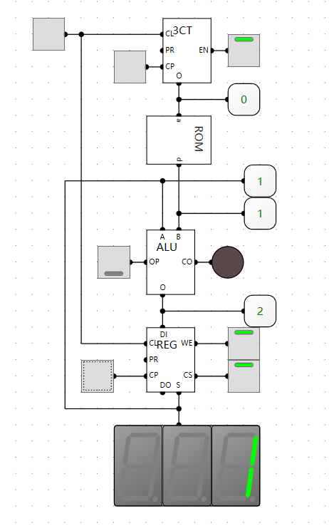

- 然后再给计数器一个时钟信号，读出ROM中1地址的数据。ALU经过加法运算后输出到寄存器的输入。
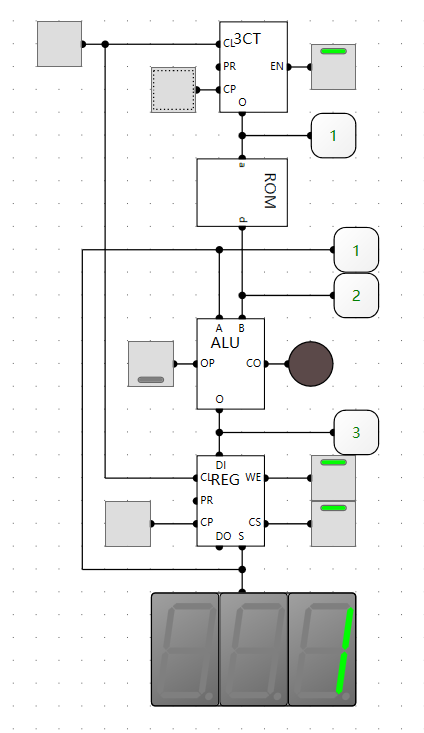


- 再给寄存器一个时钟信号，让计算结果再写到A
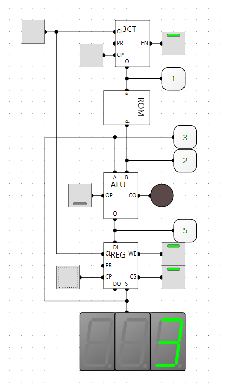

- 依次循环，即可实现半自动加法。


## 全自动加法机

***参考工程：[17 全自动加法机](https://github.com/StevenBaby/computer/tree/main/cpu/17%20%E5%85%A8%E8%87%AA%E5%8A%A8%E5%8A%A0%E6%B3%95%E6%9C%BA)***

> 上面我们做出来一个半自动加法机，现在我们尝试实现一个全自动加法机，不需要我们手动去给时钟信号。

- 首先我们创建一个自动化总线：可以控制启动和停止，并提供时钟信号的一个总线

我们需要两个开关和两个按键：
- `POW`：启动开关，1启动，0关闭
- `MAN`：手动时钟开关，1手动提供时钟，0自动时钟(测试用)
- `RES`：复位按键，按下之后总线提供一个复位信号
- `PUL`：手动时钟按键，通过该按键手动提供时钟信号(测试用)

同时提供一个`停止输入`和`时钟输入`，`复位输出`和`时钟输出`

- `HLT`：停止信号输入，提供一个输入口让外部提供一个停止信号，时钟信号就被关闭
- `CLOCK`：内部提供一个时钟输入，没有接口
- `RES`：一个复位输出信号，给总线上的器件一个复位信号(初始化或者复位时使用)
- `CP`：时钟输出，给总线上器件提供时钟信号

总线布局如下：

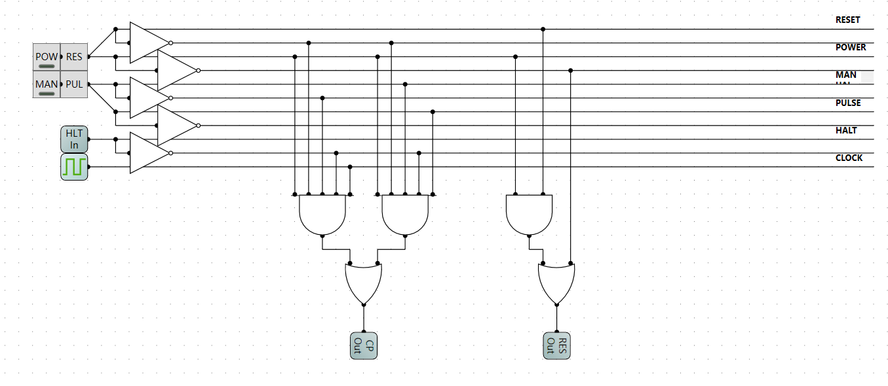


分析一下两个信号输出：`时钟输出`和`复位输出`

- ***时钟输出***
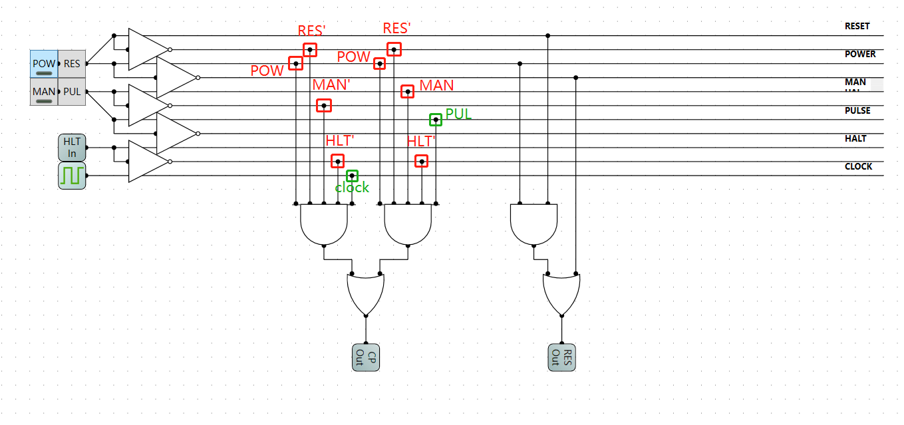


用文字语言描述就是：有两种提供时钟信号的方式，分别是`时钟信号`和`手动脉冲信号`，受`MAN`的控制，前提是电源打开，没有复位，没有停止信号。

- ***复位输出***
  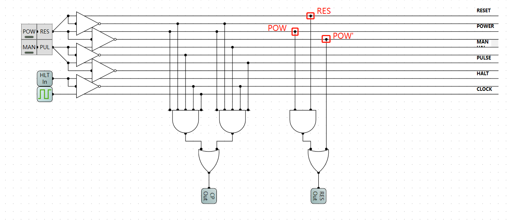
  复位信号的条件是：1、电源没有打开 2、电源打开的同时按下复位信号

然后我们将前面的半自动加法器移植到这里，构成全自动加法机

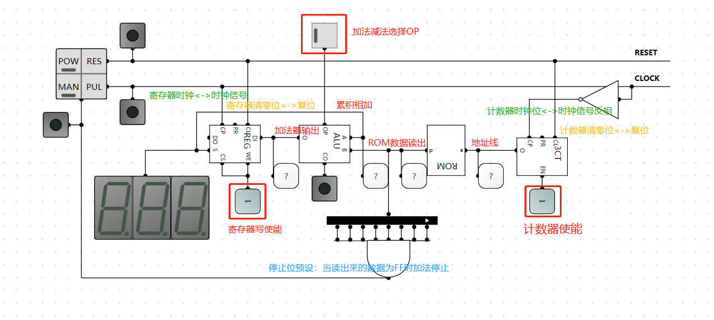
运行步骤

ROM里预置数据

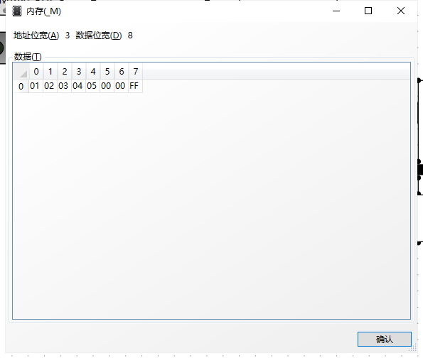

- 启动仿真，RES复位一直拉高，计数器和寄存器复位(清零)
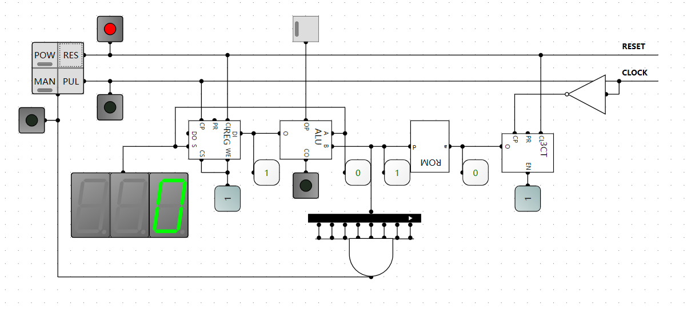
- 按下POW，启动全自动加法机，此时时钟信号打开，复位信号关闭(为了方便观察，使用手动信号)，按下PUL输入，第一个上升沿，寄存器执行写操作，将ROM的0地址数据写到A输入口；松开PUL，第一个下降沿，对应计数器的第一个上升沿，计数器+1，ROM地址+1，读出ROM的1地址数据。
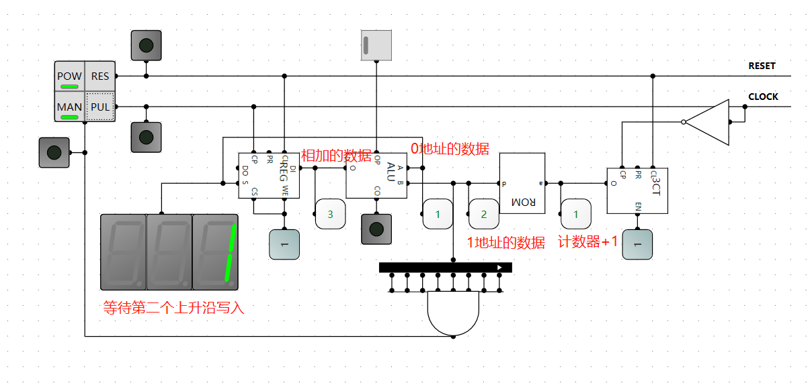
- 依次类推，关闭手动时钟信号，开启自动时钟信号，全自动加法机自动完成运算(读到FF数据停止运算)
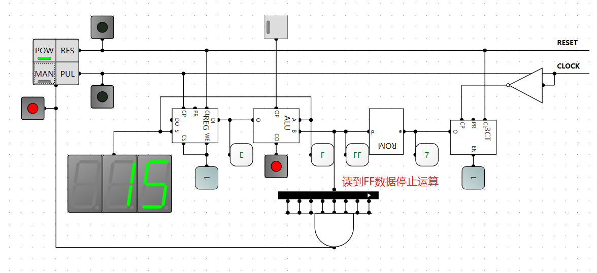


## 程序计数器和内存

***参考工程：[18 程序计数器和内存](https://github.com/StevenBaby/computer/tree/main/cpu/18%20%E7%A8%8B%E5%BA%8F%E8%AE%A1%E6%95%B0%E5%99%A8%E5%92%8C%E5%86%85%E5%AD%98)***

> 这一节我们来实现一个程序计数器，来支持后面微控制器程序的运行，程序计数器和前面的8位计数器其实差不多。

> 但是因为要支持跳转指令，所以要原来的8位计数器需要做个改造，加一个预置数的功能，所以其实程序计数器本质是一个寄存器加上+1的功能。

程序计数器实现

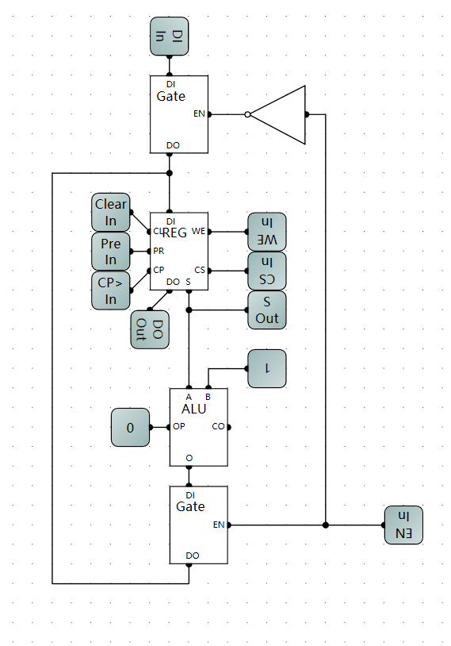


- `EN`：三态门使能，在输入输出端分别加上三态门用来隔离总线；EN=1输出(计数)，EN=0输入(预置数)

功能测试

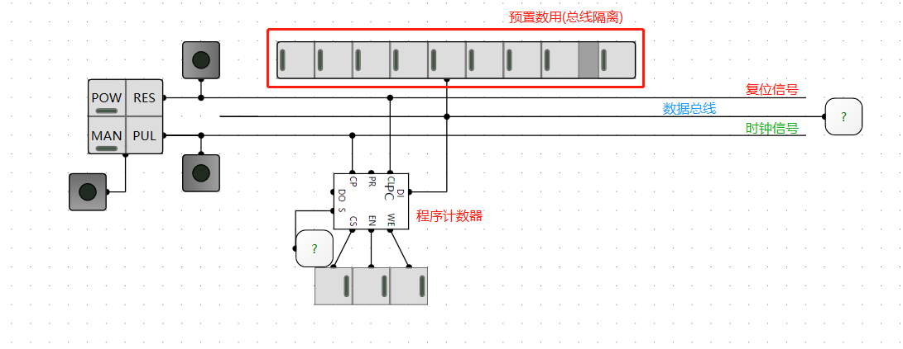
- 上电(POW打开)，程序计数器CS=1WE=1写使能，EN=1计数使能，程序计数器(PC)从零开始增加
- 预置数6，打开三态门，数据被送到总线上，EN=0程序计数器预置数功能打开，程序计数器预置数6
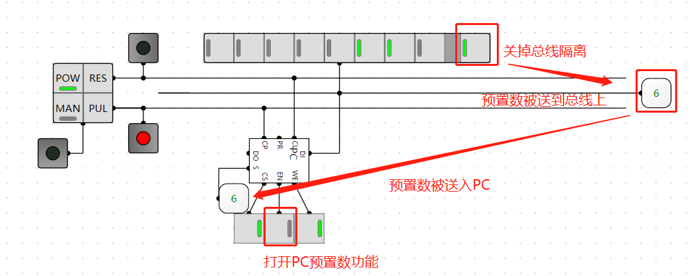

- 打开PC计数功能，计数器从6开始自增，打开预置数器的总线隔离，总线上数据6消失
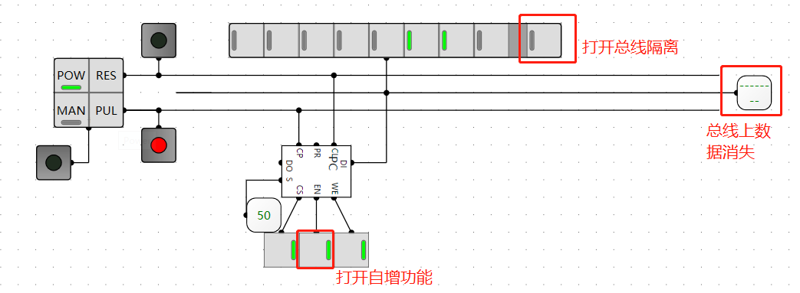


### 通过程序计数器读取内存

> 前面说道，程序计数器的作用就是用来读取程序，一般程序都放在RAM里，所以这里我们利用程序计数器来读取一下RAM里的数据。

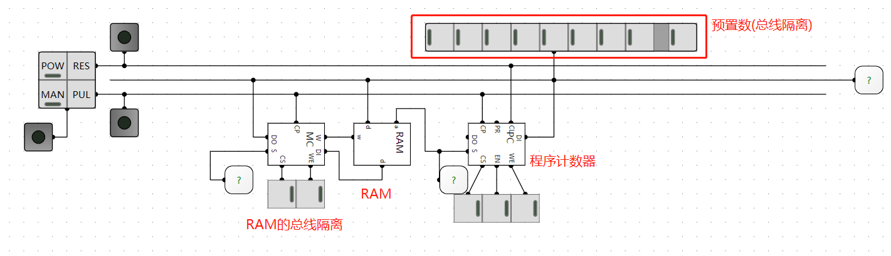

- 设置RAM为随机数，打开仿真，先看一下RAM里的随机数
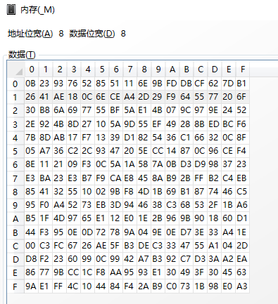

- 选择手动脉冲输入(MAN打开)，初始，读出RAM的0地址数据B
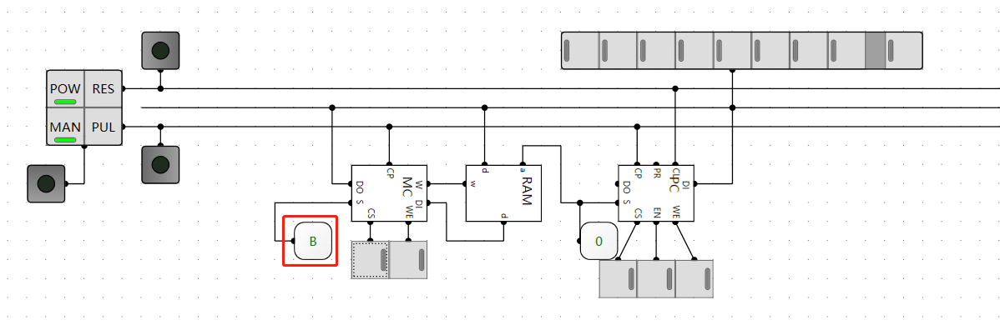
- 打开计数器计数功能(CS=WE=EN=1)，RAM的总线隔离打开(CS=WE=1)，手动输入一个脉冲，则读出第一个数据23(但是并没有读到总线上，关掉总线隔离即可读到总线上)
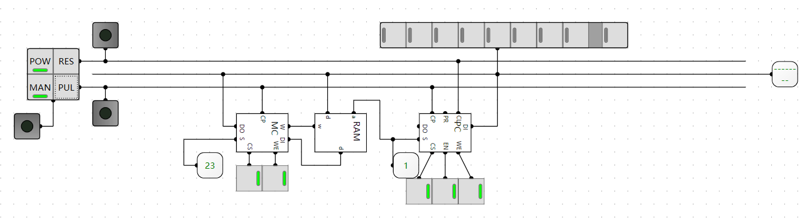

- 现在要指定读RAM的5地址的数据，查的是85，读取步骤：打开RAM总线隔离(CS=WE=1)->打开计数器预置数功能(CS=WE=1，EN=0)->关闭预置数(提前设置为5)总线隔离->给一个时钟脉冲
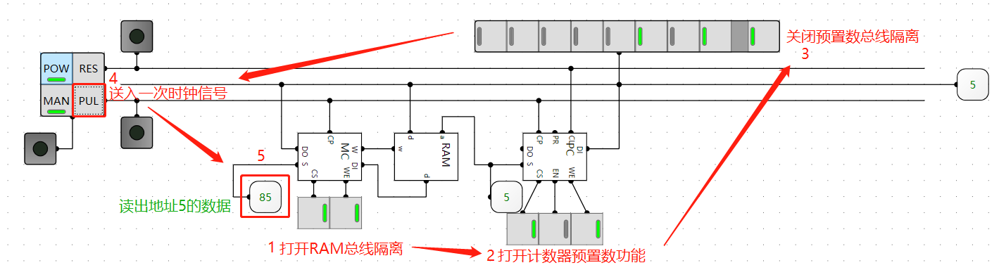


## 微程序控制

***参考工程：[19 微程序控制](https://github.com/StevenBaby/computer/tree/main/cpu/19%20%E5%BE%AE%E7%A8%8B%E5%BA%8F%E6%8E%A7%E5%88%B6)***

> ！！！注意：此章是本部分最重要的内容

> 前面做了`全自动加法机`和`程序计数器`两个重要的功能，其中`程序计数器PC`是程序运行的一个重要部分，他的功能就是顺序读取RAM或者ROM里的数据(计数器自增)和跳转功能，那么本节就是来讲如何将对寄存器以及其他器件的控制转化ROM中的数据(即程序)。

> CPU的控制分为两种，分布是`微程序控制`和`硬布线`。`微程序控制`是较为简单的一种，我们这里就介绍这种，相信介绍完之后，大家会对硬布线的理解也会更加深刻。

> 考虑实现这样一个功能：将RAM中0地址和1地址的数据相加，结果放到2地址中。

首先，我们需要改造一下ALU，将他也连到总线上

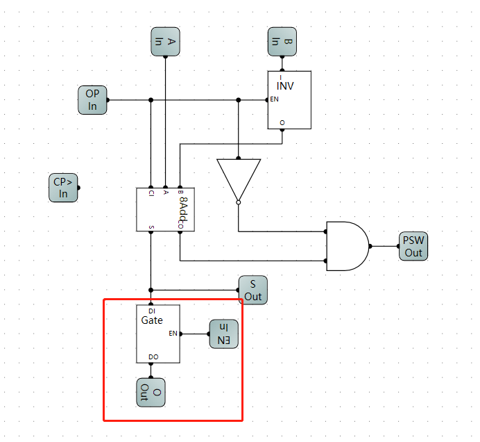

> 功能描述：将RAM中0地址和1地址的数据相加，结果放到2地址中。

### 硬件设计

***要完成上面的功能，需要完成以下操作***
- 从`RAM`里读写数据
- 需要额外的`三个寄存器`来作为中间量做运算使用
- 需要一个`ALU单元`做加法运算
- 需要一套`取指系统`(从`ROM`读取程序)
- `控制总线`(要通过这个控制总线来控制所有的器件)
- `数据总线`(所有器件的数据交换需要通过这个总线)

我们一个个来解决：

- ***从`RAM`里读写数据***

使用前面搭建的PC程序计数器读取RAM电路
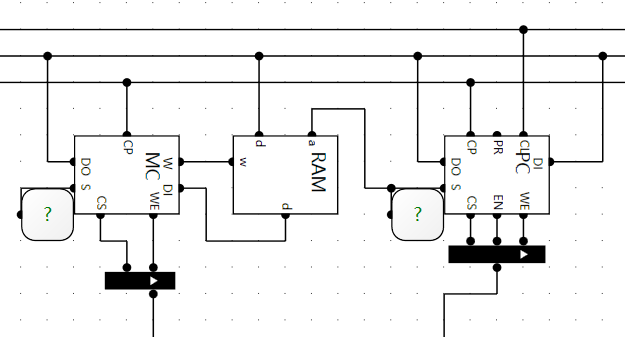

- ***需要额外的`三个寄存器`来作为中间量做运算使用、一个`ALU单元`做加法运算***

A寄存器中数据加上B寄存器中数据送到C寄存器中

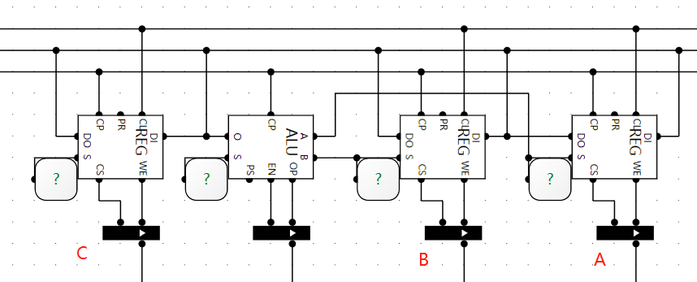

- ***需要一套`取指系统`(从`ROM`读取程序)***

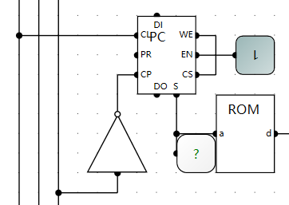


- `控制总线`(要通过这个控制总线来控制所有的器件)、`数据总线`(所有器件的数据交换需要通过这个总线)


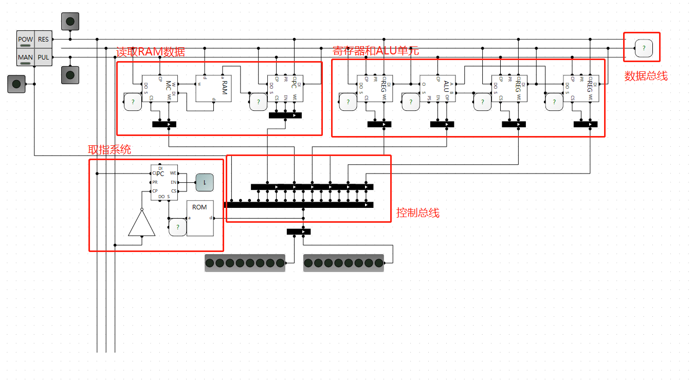
### 指令设计

重点分析一下控制总线：

控制总线总共`16`位

- `寄存器A`的`WE`接0位，`CS`接1位
- `寄存器B`的`WE`接2位，`CS`接3位
- `寄存器C`的`EW`接4位，`CS`接5位
- `ALU单元`的`OP`接6位，`EN`接7位
- `RAM总线隔离`的`WE`接8位，`CS`接9位
- `PC计数器`的`WE`接10位，`EN`接11位，`CS`接12位
- `程序停止HLT`的接15位


> 其实根据我们前面的经验可以知道，运算步骤其实就是控制这些位的通断，那么根据这个原理我们设计一下该套系统的指令

```
WE_A = 2 ** 0  # 寄存器A的WE位接0位，使能为1
CS_A = 2 ** 1  # 寄存器A的CS位接1位，使能为1

WE_B = 2 ** 2  # 寄存器B的WE位接2位，使能为1
CS_B = 2 ** 3  # 寄存器B的CS位接3位，使能为1

WE_C = 2 ** 4  # 寄存器C的WE位接4位，使能为1
CS_C = 2 ** 5  # 寄存器C的CS位接5位，使能为1

ALU_ADD = 0    # ALU单元的OP接6位，设为0 加法
ALU_SUB = 2 ** 6 # ALU单元的OP接6位，设为1 减法
ALU_OUT = 2 ** 7 # ALU单元的EN接7位，使能为1

WE_M = 2 ** 8  # RAM的总线隔离WE位接8位，使能为1
CS_M = 2 ** 9  # RAM的总线隔离CS位接9位，使能为1

WE_PC = 2 ** 10 # PC计数器的WE位接10位，使能为1
EN_PC = 2 ** 11 # PC计数器的EN位接11位，使能为1
CS_PC = 2 ** 12 # PC计数器的CS位接12位，使能为1

HLT = 2 ** 15   # 程序停止HLT位接15位，使能为1 程序停止

```

### 程序分析

> 要完成`将RAM中0地址和1地址的数据相加，结果放到2地址中`这样一个任务，我们分析一下需要如何做。

- 首先将`RAM`的`0地址的数据`取出送到`A寄存器`中
- 然后将`RAM`的`1地址的数据`去除送到`B寄存器`中
- 通过`ALU`加法运算过后的数据送到`C寄存器`中
- 最后将计算过后的数据(在`C寄存器`里)送到`RAM`的`2地址`
- 程序结束

详细动作

- ***首先将`RAM`的`0地址的数据`取出送到`A寄存器`中***
    将`RAM输出总线隔离`关闭(`CS=1，WE=0`)，`寄存器A`的写打开(`CS=WE=1`)，完了之后PC计数器打开计数器功能(`WE=EN=CS=1`)
    翻译为机器语言就是`CS_M | CS_A | WE_A | WE_PC | EN_PC | CS_PC(0001 1110 0000 0011b=1e 03h)`

- ***然后将`RAM`的`1地址的数据`去除送到`B寄存器`中***
    将`RAM输出总线隔离`关闭(`CS=1，WE=0`)，`寄存器B`的写打开(`CS=WE=1`)，完了之后`PC计数器`打开计数器功能(`WE=EN=CS=1`)
    翻译为机器语言就是`CS_M | CS_A | WE_A | WE_PC | EN_PC | CS_PC(0001 1110 0000 1100b=1e 0ch)`

- ***通过`ALU`加法运算过后的数据送到`C寄存器`中***
    `ALU运算单元`设置为加法使能(`OP=0，EN=1`)，然后将`寄存器C`的写打开(`CS=WE=1`)
    翻译为机器语言就是`ALU_SUB | ALU_OUT | CS_C | WE_C(0000 0000 1011 0000b=00 b0ch)`

- ***最后将计算过后的数据(在`C寄存器`里)送到`RAM`的`2地址`***
    `寄存器C`的读打开(`CS=1，WE=0`)，`RAM`的写打开(`CS=1，WE=1`)，完了之后`PC计数器`打开计数器功能(`WE=EN=CS=1`)(也可以不用)
    翻译为机器语言就是`CS_C | WE_M | CS_M | WE_PC | EN_PC | CS_PC(0001 1111 0010 0000b=1f 20ch)`

- ***程序结束***
    HLT置1
    翻译为机器语言就是`HLT(1000 0000 0000 0000b=80 00ch)`

总结所有的指令为
```
    CS_M | CS_A | WE_A | WE_PC | EN_PC | CS_PC,
    CS_M | CS_B | WE_B | WE_PC | EN_PC | CS_PC,
    ALU_ADD | ALU_OUT | CS_C | WE_C,
    CS_C | WE_M | CS_M | WE_PC | EN_PC | CS_PC,
    HLT
```

### 编译下载

将指令转换为二进制文件

```py
import os

dirname = os.path.dirname(__file__)
filename = os.path.join(dirname, 'ins.bin')


WE_A = 2 ** 0  # 1
CS_A = 2 ** 1  # 1x

WE_B = 2 ** 2  # 1xx
CS_B = 2 ** 3

WE_C = 2 ** 4  # 1xx
CS_C = 2 ** 5

ALU_ADD = 0
ALU_SUB = 2 ** 6
ALU_OUT = 2 ** 7

WE_M = 2 ** 8
CS_M = 2 ** 9

WE_PC = 2 ** 10
EN_PC = 2 ** 11
CS_PC = 2 ** 12

HLT = 2 ** 15

micro = [
    CS_M | CS_A | WE_A | WE_PC | EN_PC | CS_PC,
    CS_M | CS_B | WE_B | WE_PC | EN_PC | CS_PC,
    ALU_ADD | ALU_OUT | CS_C | WE_C,
    CS_C | WE_M | CS_M | WE_PC | EN_PC | CS_PC,
    HLT,
]

with open(filename, 'wb') as file:
    for value in micro:
        result = value.to_bytes(2, byteorder='little')
        file.write(result)
        print(value, result)

print('Finish compile!!!')

```

将二进制文件导入到ROM中

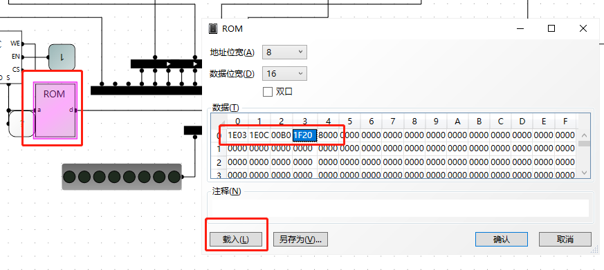


### 运行测试

提前往`RAM`里写入两个数据

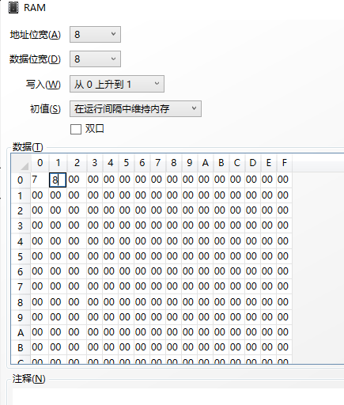

启动程序

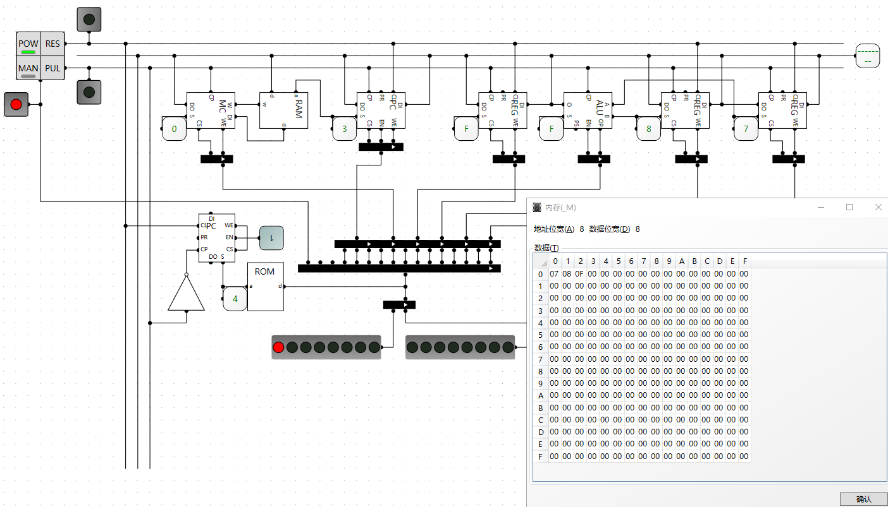
可以步进跟踪程序，也可以改一改指令。


## 逻辑运算

***参考工程：[20 逻辑运算](https://github.com/StevenBaby/computer/tree/main/cpu/20%20%E9%80%BB%E8%BE%91%E8%BF%90%E7%AE%97)***

> ALU除了支持加法减法，还要支持，乘法除法(可以用加法减法来实现)，逻辑运算

> 这一节来实现一下逻辑运算中的`与`、`或`、`非`、`异或`的八位逻辑运算

- ***8位`与`运算 8AND***
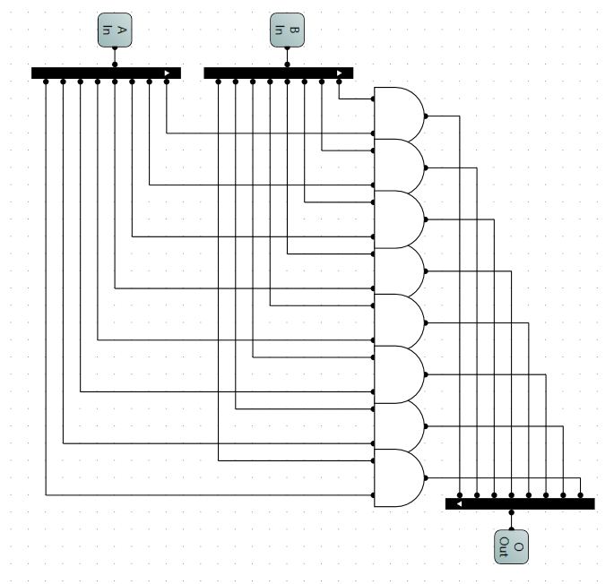

- ***8位`或`运算 8OR***


- ***8位`非`运算 Invert***
  第一部分已实现过，即8位反转
  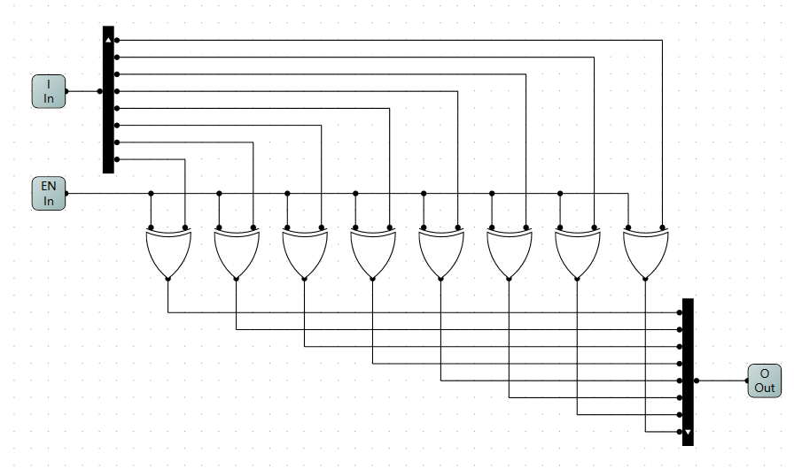
- ***8位`异或`运算 8XOR***
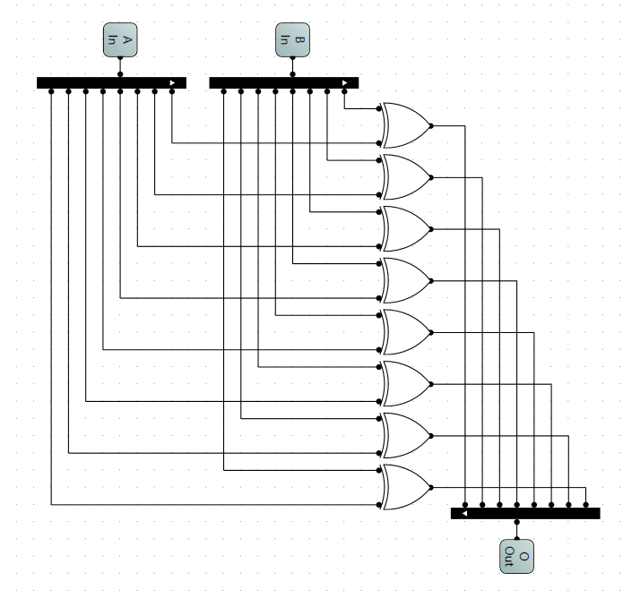


## 程序状态字

***参考工程：[21 程序状态字](https://github.com/StevenBaby/computer/tree/main/cpu/21%20%E7%A8%8B%E5%BA%8F%E7%8A%B6%E6%80%81%E5%AD%97)***

### ALU扩充

> 然后我们将以上的功能添加到ALU上，同时将运算过后的输出状态输出到程序状态字`PSW`中


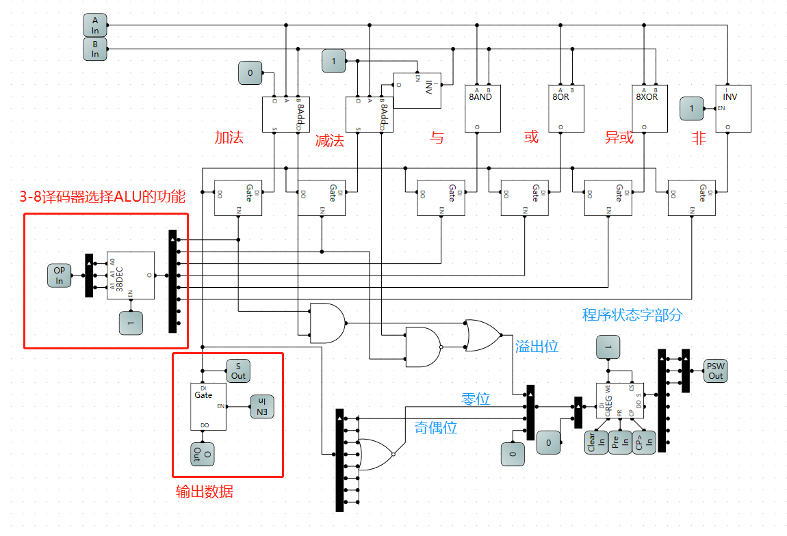