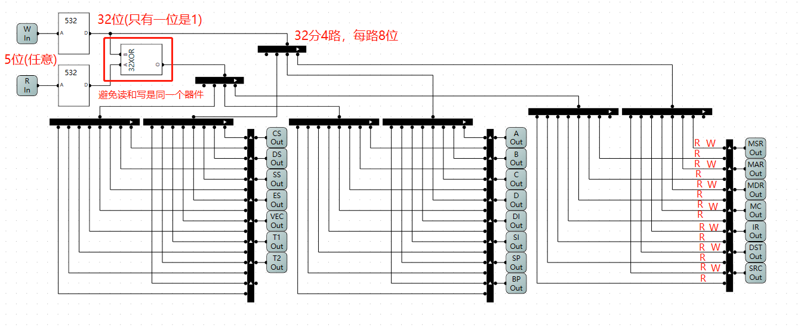

# 第三部分 CPU指令系统的实现

> 本文是对B站UP[踌躇月光](https://space.bilibili.com/491131440)出的[8位二进制CPU的设计和实现](https://www.bilibili.com/video/BV1aP4y1s7Vf)的文字教程复现第三部分 CPU指令系统的实现
相关 github 地址：https://github.com/StevenBaby/computer
PS：有错误的地方请指正，谢谢！共同学习，一起进步！

## 指令系统


> 如第二部分所述，我们实现了一些自动运算的电路部分。但是对于一个CPU来说，这些功能还不算完全。
因此，这一部分，我们将从一个整体的角度去考虑如何设计CPU的指令系统和相应的电路。


### 寄存器

> 以下是CPU需要使用的寄存器，我们需要设计电路来控制这些寄存器

- `PC` 程序计数器
- `ALU`
- `PSW/FLAG` 程序状态字
- `A` 寄存器
- `B` 寄存器
- `C` 寄存器
- `D` 寄存器
- `IR` 指令寄存器
- `DST` 目的操作数寄存器
- `SRC` 目的操作数寄存器

- `MSR` 存储器段寄存器
- `MAR` 存储器地址寄存器
- `MDR` 存储器数据寄存器
- `MC` 内存寄存器

- `SP` 堆栈指针寄存器
- `BP` 基址寄存器
- `SI` 源变址寄存器
- `DI` 目的变址寄存器
- `CS` 代码段寄存器
- `DS` 数据段寄存器
- `SS` 堆栈段寄存器
- `ES` 附加段寄存器

- `TMP` 临时寄存器若干

### 指令系统

> 除了寄存器，还有一套控制指令

- 二操作数：3bit 最高位为1
    - `mov dst , src`
    - `add dst , src`
    - `sub dst , src`
    - `cmp dst , src`
    - `and dst , src`
    - `or dst , src`
    - `xor dst , src`
- 一操作数：此最高位为1
    - `inc src`  // 可用add实现
    - `dec src` // 可用sub实现
    - `not src`
    - `call src`
    - `jmp dst`
    - `jo dst`
    - `jno dst`
    - `jz dst`
    - `jnz dst`
    - `push src`
    - `pop src`
    - `int dst`
- 零操作数：
    - `nop`
    - `hlt`
    - `ret`
    - `iret`

### 寻址方式 2 x 3bit

- 立即寻址 `MOV A , 5`
- 寄存器寻址 `MOV A , B`
- 直接寻址 `MOV A , [5]`
- 寄存器间接寻址 `MOV A , [B]`

### 程序状态字 4bit

- `OF` 溢出标志
- `ZF` 零标志
- `PF` 奇偶标志
- `IF` 中断标志

### 时钟周期 4bit

## 寄存器控制器

***参考工程：[23 寄存器控制器](https://github.com/StevenBaby/computer/tree/main/cpu/23%20%E5%AF%84%E5%AD%98%E5%99%A8%E6%8E%A7%E5%88%B6%E5%99%A8)***

### PC计数器改造

> 因为ALU经常变动，这里将PC计数器里的自增单元从ALU改为8位加法器


> 在前一部分，我们控制寄存器采用的方案是将16位进行分割，这样假设全是控制寄存器也只能控制8个寄存器，就算是用32位也只能控制16个，而我们需要控制的光是寄存器就达到了二十多个，显然是不够用的。

> 因为每次数据交换只需要使用两个器件，所以我们在这里采用压缩编码的方式：采用5-32译码器来通过5位控制32位，10位可以控制64位！！这样就够我们使用了

> 我们创建两个五位输入端，一个是W，也就是写端，还有一个是R，也就是读，这样可以分开控制两个器件，让一个写一个读即可完成数据交换。(寄存器也是两个功能：写和读)

### 532译码器和32位异或门

> 利用和38译码器同样的方式，我们制作一个532译码器

```py
import os

dirname = os.path.direname(__file__)
filename = os.path.join(dirname,'532decoder.bin')

with open(filename,'wb') as file:
    for var in range(32):
        value = 1<<var
        result = value.to_bytes(4,byteorder='little')
        file.write(result)

```


> 为了防止单个器件同时读和写的情况，这里给 W 和 R 加上一个异或门(相同则输出0)


### 寄存器控制器

> 寄存器控制器设计电路如下



可以看一下，第三个是`MDR`，第九个是`B`，寄存器的两位分别是WE和CS，读是WE=0，CS=1;写是WE=1，CS=1;


## CPU框架

***参考工程：[24 CPU框架](https://github.com/StevenBaby/computer/tree/main/cpu/24%20CPU%E6%A1%86%E6%9E%B6)***

> 这一节我们将所有寄存器，运算单元和计数器全部放到总线上

首先将 寄存器的`WE`和`CS`汇总成两位，`CS`为高位，`WE`为低位


***寄存器连接总线通用方法***：除了特殊的，一律是 `DI` 和 `DO` 接数据总线，`CP`接时钟线，`Clear`接复位线，`Pre不`接，`IO`接CPU控制单元，`S`不接(接探针)

- `MDR`、`C`、`D`、`CS`、`DS`、`SS`、`ES`、`DI`、`SI`、`SP`、`BP`、`VEC`、`T1`、`T2`寄存器全部按照通用方法接线，`程序计数器PC`也按照通用方法接线


- `MSR`、`MAR`合并为16位地址进行RAM寻址


- 寄存器`A`和`B`接到`ALU`的输入端
 

- 寄存器`IR`、`DST`、`SRC`的S接到控制单元，这个后面会提到


以上就是寄存器挂 到总线的方式(注意特殊的地方)


## CPU控制器

***参考工程：[25 CPU控制器](https://github.com/StevenBaby/computer/tree/main/cpu/25%20CPU%E6%8E%A7%E5%88%B6%E5%99%A8)***

> 这一节比较复杂，一定要认真研究，先看一下总览图


###  寄存器读写控制器

> 前一节CPU框架介绍了寄存器读写总线是如何建立的，读写控制器的作用是三选一


### 取指系统


将CPU控制器接入整个系统


## 取指令微程序

***参考工程：[26 取指令微程序](https://github.com/StevenBaby/computer/tree/main/cpu/26%20%E5%8F%96%E6%8C%87%E4%BB%A4%E5%BE%AE%E7%A8%8B%E5%BA%8F)***

> 回顾第二部分我们搭建的那个小型自动电路用来完成某项任务所写的微程序

> 现在我们 为上面这样一个完整的CPU来写一个微程序完成以下任务：

> ***任务描述：将RAM中0地址 1地址 2地址数据分别取出放入IR DST SRC寄存器中。***

### 指令设计

```py pin.py
# coding=utf-8

MSR = 1
MAR = 2
MDR = 3
RAM = 4
IR = 5
DST = 6
SRC = 7
A = 8
B = 9
C = 10
D = 11
DI = 12
SI = 13
SP = 14
BP = 15
CS = 16
DS = 17
SS = 18
ES = 19
VEC = 20
T1 = 21
T2 = 22

MSR_OUT = MSR
MAR_OUT = MAR
MDR_OUT = MDR
RAM_OUT = RAM
IR_OUT = IR
DST_OUT = DST
SRC_OUT = SRC
A_OUT = A
B_OUT = B
C_OUT = C
D_OUT = D
DI_OUT = DI
SI_OUT = SI
SP_OUT = SP
BP_OUT = BP
CS_OUT = CS
DS_OUT = DS
SS_OUT = SS
ES_OUT = ES
VEC_OUT = VEC
T1_OUT = T1
T2_OUT = T2

_DST_SHIFT = 5

MSR_IN = MSR << _DST_SHIFT
MAR_IN = MAR << _DST_SHIFT
MDR_IN = MDR << _DST_SHIFT
RAM_IN = RAM << _DST_SHIFT
IR_IN = IR << _DST_SHIFT
DST_IN = DST << _DST_SHIFT
SRC_IN = SRC << _DST_SHIFT
A_IN = A << _DST_SHIFT
B_IN = B << _DST_SHIFT
C_IN = C << _DST_SHIFT
D_IN = D << _DST_SHIFT
DI_IN = DI << _DST_SHIFT
SI_IN = SI << _DST_SHIFT
SP_IN = SP << _DST_SHIFT
BP_IN = BP << _DST_SHIFT
CS_IN = CS << _DST_SHIFT
DS_IN = DS << _DST_SHIFT
SS_IN = SS << _DST_SHIFT
ES_IN = ES << _DST_SHIFT
VEC_IN = VEC << _DST_SHIFT
T1_IN = T1 << _DST_SHIFT
T2_IN = T2 << _DST_SHIFT

SRC_R = 2 ** 10
SRC_W = 2 ** 11
DST_R = 2 ** 12
DST_W = 2 ** 13

PC_WE = 2 ** 14
PC_CS = 2 ** 15
PC_EN = 2 ** 16

PC_OUT = PC_CS
PC_IN = PC_CS | PC_WE
PC_INC = PC_CS | PC_WE | PC_EN


HLT = 2 ** 31
```

`OUT`指读寄存器即将寄存器数据送到总线，`IN`指写寄存器，`W`处于高五位，`R`处于低五位

### 程序设计

```py assembly.py
# coding=utf-8

import pin

FETCH = [
    pin.PC_OUT | pin.MAR_IN,
    pin.RAM_OUT | pin.IR_IN | pin.PC_INC,
    pin.PC_OUT | pin.MAR_IN,
    pin.RAM_OUT | pin.DST_IN | pin.PC_INC,
    pin.PC_OUT | pin.MAR_IN,
    pin.RAM_OUT | pin.SRC_IN | pin.PC_INC,
]

```
- `pin.PC_OUT | pin.MAR_IN` 程序计数器`PC`的数送到存储器地址寄存器`MAR`
- `pin.RAM_OUT | pin.IR_IN | pin.PC_INC` 存储器地址寄存器`MAR`指向`RAM`地址的数据送到指令寄存器`IR`，程序计数器`PC`+1
- `pin.PC_OUT | pin.MAR_IN` 程序计数器`PC`的数送到存储器地址寄存器`MAR`
- `pin.RAM_OUT | pin.DST_IN | pin.PC_INC`存储器地址寄存器`MAR`指向`RAM`地址的数据送到目的数寄存器`DST`，程序计数器`PC`+1
- `pin.PC_OUT | pin.MAR_IN` 程序计数器`PC`的数送到存储器地址寄存器`MAR`
- `pin.RAM_OUT | pin.SRC_IN | pin.PC_INC`存储器地址寄存器`MAR`指向`RAM`地址的数据送到目的数寄存器`SRC`，程序计数器`PC`+1


### 编译下载

```py controller.py    
# coding=utf-8

import os
import pin
import assembly as ASM

dirname = os.path.dirname(__file__)
filename = os.path.join(dirname, 'micro.bin')

micro = [pin.HLT for _ in range(0x10000)] # 在ROM里写满HLT指令

for addr in range(0x10000):
    ir = addr >> 8            # 从地址中取出IR即指令信息
    psw = (addr >> 4) & 0xf   # 从地址中取出PSW即状态字信息
    cyc = addr & 0xf          # 从地址中取出系统时钟周期信息

    if cyc < len(ASM.FETCH):  # 如果将指令一个个填充进去
        micro[addr] = ASM.FETCH[cyc]

with open(filename, 'wb') as file: # 转换成二进制
    for var in micro:
        value = var.to_bytes(4, byteorder='little')
        file.write(value)

print('Compile micro instruction finish!!!')


```

将二进制文件下载进ROM里


### 启动运行


取指令功能实现

## 指令集

> 我们知道存放程序(`ROM`)的地址有16位，高八位代表指令，中间四位代表状态字，后四位代表微程序的周期，即

| 指令 IR 8位 | 程序状态字PSW | 微程序周期 |

- 指令 `IR` 8位：最高支持`256`个指令
- 程序状态字`PSW`
- 微程序周期 4位：单个指令的周期为`16`，就是支持`16`个微指令，不能超过`16`个

> 关于指令集，再说几点
- 上面的`ROM`里存放的就是`指令集`
- 指令集最高支持`256`个指令，每个指令支持`16`个微指令
- 而我们的程序是写在`RAM`里的，`RAM`里存放的是指令，指令集里每个指令的前面几个微指令都会有把`RAM`里指令读出来的功能。


### MOV指令

***参考工程：[27 MOV 指令](https://github.com/StevenBaby/computer/tree/main/cpu/27%20MOV%20%E6%8C%87%E4%BB%A4)***

假设指令为

`MOV A , 5`：该指令为两种寻址方式：`寄存器寻址`和`立即寻址`

---

总共表示四种寻址方式：

- 立即寻址 `MOV A , 5`
- 寄存器寻址 `MOV A , B`
- 直接寻址 `MOV A , [5]`
- 寄存器间接寻址 `MOV A , [B]`

***我们做以下编码***：

- `立即寻址` = `0`
- `寄存器寻址` = `1`
- `直接寻址` = `2`
- `寄存器间接寻址` = `3`


---

对于不同长度的指令：

- 二地址指令 `MOV A,B`
- 一地址指令 `NOT A`
- 零地址指令 `HLT`

***我们做以下编码***：

- 二地址指令
    - `1xxx [aa] [bb]` # 这里aa，bb均代表寻址方式
- 一地址指令
    - `01xxxx[aa]` # 这里aa代表寻址方式
- 零地址指令
    - `00xxxxxx`


---

根据以上编码原理，我们写下编译器预定义程序

```py pin.py

CYC = 2 ** 30
HLT = 2 ** 31

... #省略控制定义

## 指令长度定义

ADDR2 = 1 << 7 # 二地址指令 1xxx xxxx
ADDR1 = 1 << 6 # 一地址指令 01xx xxxx

ADDR2_SHIFT = 4 # 二地址指令偏移
ADDR1_SHIFT = 2 # 一地址指令偏移

## 寻址方式定义

AM_INS = 0 # 立即寻址编号
AM_REG = 1 # 寄存器寻址编号
AM_DIR = 2 # 直接寻址编号
AM_RAM = 3 # 寄存器间接寻址编号


```

通过上面我们可以定义汇编指令


```py assembly.py

MOV = 0 | pin.ADDR2                       # MOV指令定义位1000 xxxx
ADD = (1 << pin.ADDR2_SHIFT) | pin.ADDR2  # ADD指令定义为 1001 xxxx

NOP = 0     # NOP指令定义为 0000 0000
HLT = 0x3f  # HLT指令定义为 0011 1111

```

然后我们对指令的寻址方式进行定义

```py assembly.py

INSTRUCTIONS = {
    2: { # 二操作数指令列表
        MOV: { # MOV指令寻址方式列表
            (pin.AM_REG, pin.AM_INS): [  # (寄存器寻址，立即寻址) 例如 MOV A,5
                pin.DST_W | pin.SRC_OUT, # 微指令：DST寄存器写，SRC读，SRC->DST，这里DST是控制寄存器写
            ]
        }
    },
    1: {},# 一操作数指令列表
    0: {  # 零操作数指令列表
        NOP: [
            pin.CYC, # 让指令周期清零，跳过这次指令
        ],
        HLT: [
            pin.HLT, # 指令停止
        ]
    }
}

```


#### 生成指令集

> 在看这段程序之前，我再强调一下几点概念
> 首先是指令，上面我们所做的事情都是在对指令进行编码，如`MOV`，我们编码为`1000 xxxx`，`MOV 寄存器，立即数` 我们编码为`1000 0100`，这样的编码是为了方便在将指令放在`RAM`中(同时在`ROM`指令集里寻找到相应的`微指令`)，我们将汇编语言如`MOV 寄存器，立即数`翻译成`1000 0100`称作编译，但是编译出来的`1000 0100`这样的机器语言仍然只是编码。真正的指令是存放在`CPU`内部的`ROM`指令集里的，我们需要用这个机器语言去找到对应的`微指令`。而这个微指令才是真正控制`CPU`里的所有资源的指令。

> 好了，接下来我们来看生成这样的指令集的程序


```py
# coding=utf-8

import os
import pin
import assembly as ASM

dirname = os.path.dirname(__file__)
filename = os.path.join(dirname, 'micro.bin')

micro = [pin.HLT for _ in range(0x10000)] # 将程序停止指令放满整个指令集


def compile_addr2(addr, ir, psw, index): # 处理二操作数的指令
    global micro

    op = ir & 0xf0 # 取出操作指令
    amd = (ir >> 2) & 3 # 取出目标操作数的寻址方式
    ams = ir & 3 # 取出源操作数的寻址方式

    INST = ASM.INSTRUCTIONS[2] # 取出二操作数的所有指令的列表
    if op not in INST:         # 遍历二操作数的所有指令看存不存在，如果不存在
        micro[addr] = pin.CYC # 跳过该指令
        return
    am = (amd, ams) # 目的操作数和源操作数合起来
    if am not in INST[op]: # 遍历该指令下的所有寻址方式，如果不存在
        micro[addr] = pin.CYC # 跳过该指令
        return

    EXEC = INST[op][am] # 假设指令和寻址方式都找到了，则拷贝出对应的微指令
    if index < len(EXEC): # 把指令补到后面
        micro[addr] = EXEC[index]
    else:
        micro[addr] = pin.CYC


def compile_addr1(addr, ir, psw, index): # 处理一操作数的指令
    pass


def compile_addr0(addr, ir, psw, index): # 处理零操作数的指令
    global micro

    op = ir # 取出操作指令

    INST = ASM.INSTRUCTIONS[0] # 取出零操作数的所有指令的列表
    if op not in INST: # 遍历二操作数的所有指令看存不存在，如果不存在
        micro[addr] = pin.CYC # 跳过该指令
        return

    EXEC = INST[op] # 假设指令找到了，则拷贝出对应的微指令
    if index < len(EXEC): # 把指令补到后面
        micro[addr] = EXEC[index]
    else:
        micro[addr] = pin.CYC


for addr in range(0x10000): # 对整个指令集依次处理
    ir = addr >> 8            # 取出表示指令的一段
    psw = (addr >> 4) & 0xf   # 取出表示状态字的一段
    cyc = addr & 0xf          # 取出微指令周期的一段

    if cyc < len(ASM.FETCH): # 这里是将一段取值微程序放到所有指令中
        micro[addr] = ASM.FETCH[cyc]
        continue

    addr2 = ir & (1 << 7)    # 取出表示二操作数指令的位
    addr1 = ir & (1 << 6)    # 取出表示一操作数指令的位

    index = cyc - len(ASM.FETCH) # ASM.FETCH已经有6个指令

    if addr2: # 对操作数不同的指令分情况处理
        compile_addr2(addr, ir, psw, index)
    elif addr1:
        compile_addr1(addr, ir, psw, index)
    else:
        compile_addr0(addr, ir, psw, index)


with open(filename, 'wb') as file:
    for var in micro:
        value = var.to_bytes(4, byteorder='little')
        file.write(value)

print('Compile micro instruction finish!!!')


```

将编译完后的指令集下载到ROM里

现在我们手动往RAM里写程序

`MOV A,5` 机器码 `84 08 05`
`HLT`          机器码 `3F`


启动运行


但是这里还没有实现汇编的编译器，所以看下一节


### 汇编编译器

***参考工程：[28 汇编编译器](https://github.com/StevenBaby/computer/tree/main/cpu/28%20%E6%B1%87%E7%BC%96%E7%BC%96%E8%AF%91%E5%99%A8)***

> 本节来写一下编译器，实现将汇编指令翻译成机器语言

```py

# coding=utf-8

import os
import re

import pin
import assembly as ASM

dirname = os.path.dirname(__file__)

inputfile = os.path.join(dirname, 'program.asm') # 读入汇编文件
outputfile = os.path.join(dirname, 'program.bin')

annotation = re.compile(r"(.*?);.*") # 正则匹配

codes = []

OP2 = { # 二操作数指令列表
    'MOV': ASM.MOV
}

OP1 = { # 一操作数指令列表

}

OP0 = { # 零操作数指令列表
    'NOP': ASM.NOP,
    'HLT': ASM.HLT,
}

OP2SET = set(OP2.values()) 
OP1SET = set(OP1.values())
OP0SET = set(OP0.values())

REGISTERS = { # 可操作寄存器
    "A": pin.A,
    "B": pin.B,
    "C": pin.C,
    "D": pin.D,
}


class Code(object): # Code对象

    def __init__(self, number, source):
        self.numer = number # 行号
        self.source = source.upper() # 源代码
        self.op = None
        self.dst = None
        self.src = None
        self.prepare_source() # 调用预处理源代码

    def get_op(self): # 获取指令
        if self.op in OP2:
            return OP2[self.op]
        if self.op in OP1:
            return OP1[self.op]
        if self.op in OP0:
            return OP0[self.op]
        raise SyntaxError(self)

    def get_am(self, addr): # 获取目的 操作数和源操作数
        if not addr: # 如果啥都没有，返回0
            return 0, 0
        if addr in REGISTERS: # 如果是寄存器，列表中存在返回寄存器编码
            return pin.AM_REG, REGISTERS[addr]
        if re.match(r'^[0-9]+$', addr): # 如果是数字，返回立即数
            return pin.AM_INS, int(addr)
        if re.match(r'^0X[0-9A-F]+$', addr): # 如果是十六进制数，返回十六进制立即数
            return pin.AM_INS, int(addr, 16)

        raise SyntaxError(self)

    def prepare_source(self): # 预处理源代码
        tup = self.source.split(',') # 用逗号分割代码
        if len(tup) > 2: # 如果分割出来长度大于2 说明语法错误
            raise SyntaxError(self)
        if len(tup) == 2: # 如果分割出来等于二
            self.src = tup[1].strip() # 把逗号后面的分配给源操作数

        tup = re.split(r" +", tup[0]) # 用正则空格来分割
        if len(tup) > 2: # 如果分割出来长度大于2 说明语法错误
            raise SyntaxError(self)
        if len(tup) == 2: # 如果等于二
            self.dst = tup[1].strip() # 将后面的分配给目的操作数

        self.op = tup[0].strip() # 前面的分配给指令

    def compile_code(self):
        op = self.get_op() # 获取指令

        amd, dst = self.get_am(self.dst) # 获取目的操作数编码
        ams, src = self.get_am(self.src) # 获取源操作数编码

        if op in OP2SET: # 获取指令编码
            ir = op | (amd << 2) | ams
        elif op in OP1SET:
            ir = op | amd
        else:
            ir = op

        return [ir, dst, src]

    def __repr__(self): # 打印的时候显示
        return f'[{self.numer}] - {self.source}' # 显示行号+源代码


class SyntaxError(Exception): # 语法错误

    def __init__(self, code: Code, *args, **kwargs):
        super().__init__(*args, **kwargs)
        self.code = code


def compile_program():
    with open(inputfile, encoding='utf8') as file: # 读入汇编文件
        lines = file.readlines() # 记录行号

    for index, line in enumerate(lines):
        source = line.strip() # 将两端的空格去掉
        if ';' in source: # 将;后面的去掉
            match = annotation.match(source)
            source = match.group(1)
        if not source: # 如果没有代码跳过
            continue
        code = Code(index + 1, source) # 生成Code类对源代码进行处理
        codes.append(code)

    with open(outputfile, 'wb') as file:
        for code in codes:
            values = code.compile_code() # 获得 编码
            for value in values:
                result = value.to_bytes(1, byteorder='little')
                file.write(result)


def main():
    compile_program()
    # try:
    #     compile_program()
    # except SyntaxError as e:
    #     print(f'Syntax error at {e.code}')
    #     return

    print('compile program.asm finished!!!')


if __name__ == '__main__':
    main()


```

在`asm`文件里写入以下程序

```asm
MOV A, 5; this is annotation

MOV A, 5

MOV B, 10;

MOV C, 11;

MOV A, 0x30;

MOV D, 0x30;

hlt;

```
启动编译器，我们得到bin文件

```bin
84 08 05 84 08 05 84 09 0A 84 0A 0B 84 08 30 84 0B 30 3F 00 00

```

- `84 08 05` ：`MOV A, 5`
    - `84 = 1000 0100` ：`MOV 寄存器寻址，立即数寻址`
    - `08`：寄存器A的编码
    - `05`：立即数5

- `84 08 05`
- `84 09 0A`：`MOV B, 10`
    - `84 = 1000 0100` ：`MOV 寄存器寻址，立即数寻址`
    - `09`：寄存器B的编码
    - `0A`：立即数10
- `84 0A 0B`：`MOV C, 11`
    - `84 = 1000 0100` ：`MOV 寄存器寻址，立即数寻址`
    - `0A`：寄存器C的编码
    - `0B`：立即数11
- `84 08 30`：`MOV A, 0x30`
    - `84 = 1000 0100` ：`MOV 寄存器寻址，立即数寻址`
    - `08`：寄存器A的编码
    - `30`：立即数十六进制0x30

- `84 08 30`：`MOV A, 0x30`
    - `84 = 1000 0100` ：`MOV 寄存器寻址，立即数寻址`
    - `08`：寄存器A的编码
    - `30`：立即数十六进制0x30
- `84 0B 30`：`MOV A, 0x30`
    - `84 = 1000 0100` ：`MOV 寄存器寻址，立即数寻址`
    - `0B`：寄存器D的编码
    - `30`：立即数十六进制0x30
- `3F`：指令`hlt`的编号

将汇编编译过后的`bin`文件导入，运行


### 数据传送指令

***参考工程：[29 数据传送指令](https://github.com/StevenBaby/computer/tree/main/cpu/29%20%E6%95%B0%E6%8D%AE%E4%BC%A0%E9%80%81%E6%8C%87%E4%BB%A4)***


> 这一节我们继续实现MOV指令的其他寻址方式
- 寄存器寻址，立即寻址
- 寄存器寻址，寄存器寻址
- 寄存器寻址，直接寻址
- 寄存器寻址，寄存器间接寻址
- 直接寻址，立即寻址
- 直接寻址，寄存器寻址
- 直接寻址，直接寻址
- 直接寻址，寄存器间接寻址
- 寄存器间接寻址，立即数寻址
- 寄存器间接寻址，寄存器寻址
- 寄存器间接寻址，直接寻址
- 寄存器间接寻址，寄存器间接寻址


注：因为指令例如`MOV A,5` 的三个分别是读到`IR` ，`DST`，`SRC`三个寄存器里的，因此对于后两个寄存器`DST`，`SRC`有两个功能，一是直接读写寄存器的数据(这里我称为`寄存器读/写`)，二是通过寄存器里的数据代号间接读取或写入其他寄存器里的数值(这里我称为`读/写寄存器`)

```py
INSTRUCTIONS = {
    2: {
        MOV: {
            (pin.AM_REG, pin.AM_INS): [ # (寄存器寻址，立即寻址) 例如 MOV A,5
                pin.DST_W | pin.SRC_OUT, # 微指令：DST写寄存器，SRC寄存器读，SRC->DST，读取SRC寄存器里数据送入DST指定的寄存器中
            ],
            (pin.AM_REG, pin.AM_REG): [ # (寄存器寻址，寄存器寻址) 例如 MOV A,B
                pin.DST_W | pin.SRC_R,  # 微指令：DST写寄存器，SRC读寄存器，SRC->DST，这里DST，SRC是控制其他寄存器写和读
            ],
            (pin.AM_REG, pin.AM_DIR): [ # (寄存器寻址，直接寻址) 例如 MOV A,[5]
                pin.SRC_OUT | pin.MAR_IN, # 从SRC寄存器读，送到RAM地址线上
                pin.DST_W | pin.RAM_OUT # 从RAM指定地址读，DST写寄存器
            ],
            (pin.AM_REG, pin.AM_RAM): [ # (寄存器寻址，寄存器间接寻址) 例如 MOV A,[B]
                pin.SRC_R | pin.MAR_IN, # SRC读寄存器(数据)，送到RAM地址线上
                pin.DST_W | pin.RAM_OUT # 从RAM指定地址读数据，DST写寄存器
            ],
            (pin.AM_DIR, pin.AM_INS): [ # (直接寻址，立即寻址) 例如 MOV [5],5
                pin.DST_OUT | pin.MAR_IN, # 从DST寄存器读数据，送到RAM地址线上
                pin.RAM_IN | pin.SRC_OUT # 从SRC寄存器读数据，往RAM里写
            ],
            (pin.AM_DIR, pin.AM_REG): [ # (直接寻址，寄存器寻址) 例如 MOV [5],A
                pin.DST_OUT | pin.MAR_IN, # DST寄存器读，送到地址线上
                pin.RAM_IN | pin.SRC_R, # SRC读寄存器，往RAM里写
            ],
            (pin.AM_DIR, pin.AM_DIR): [ # (直接寻址，直接寻址) 例如 MOV [5],[2]
                pin.SRC_OUT | pin.MAR_IN, # SRC寄存器读到地址线上
                pin.RAM_OUT | pin.T1_IN, # 从RAM里读出来，写到T1寄存器里
                pin.DST_OUT | pin.MAR_IN, # 再把DST寄存器读到地址线上
                pin.RAM_IN | pin.T1_OUT, # 把T1寄存器的值写到RAM里
            ],
            (pin.AM_DIR, pin.AM_RAM): [ # (直接寻址，寄存器间接寻址) 例如 MOV [5],[A]
                pin.SRC_R | pin.MAR_IN, # SRC读寄存器到地址线上
                pin.RAM_OUT | pin.T1_IN, # 把RAM数据读到T1上
                pin.DST_OUT | pin.MAR_IN, # DST寄存器读到地址线上
                pin.RAM_IN | pin.T1_OUT, # 把T1写到RAM里
            ],

            (pin.AM_RAM, pin.AM_INS): [ # (寄存器间接寻址，立即数寻址) 例如 MOV [A],5
                pin.DST_R | pin.MAR_IN, # DST读寄存器到地址线上
                pin.RAM_IN | pin.SRC_OUT # SRC寄存器数据写到RAM里
            ],
            (pin.AM_RAM, pin.AM_REG): [ # (寄存器间接寻址，寄存器寻址) 例如 MOV [A],B
                pin.DST_R | pin.MAR_IN, # DST读寄存器到地址线上
                pin.RAM_IN | pin.SRC_R, # SRC读寄存器到RAM里
            ],
            (pin.AM_RAM, pin.AM_DIR): [ # (寄存器间接寻址，直接寻址) 例如 MOV [A],[5]
                pin.SRC_OUT | pin.MAR_IN, # SRC寄存器的数据送到地址线上
                pin.RAM_OUT | pin.T1_IN, # RAM里数据读到T1里
                pin.DST_R | pin.MAR_IN, # DST读寄存器到地址总线上
                pin.RAM_IN | pin.T1_OUT, # 把T1读到RAM里
            ],
            (pin.AM_RAM, pin.AM_RAM): [ # (寄存器间接寻址，寄存器间接寻址) 例如 MOV [A],[B]
                pin.SRC_R | pin.MAR_IN, # SRC读寄存器到地址线上
                pin.RAM_OUT | pin.T1_IN, # RAM输出到T1
                pin.DST_R | pin.MAR_IN, #  DST读寄存器到地址线上
                pin.RAM_IN | pin.T1_OUT, # T1输出到RAM
            ]
        }
    },
    1: {},
    0: {
        NOP: [
            pin.CYC,
        ],
        HLT: [
            pin.HLT,
        ]
    }
}

```
将控制器编译完后载入到ROM中


编译器大致上差不多

```py

# coding=utf-8

import os
import re

import pin
import assembly as ASM

dirname = os.path.dirname(__file__)

inputfile = os.path.join(dirname, 'program.asm')
outputfile = os.path.join(dirname, 'program.bin')

annotation = re.compile(r"(.*?);.*")

codes = []

OP2 = {
    'MOV': ASM.MOV
}

OP1 = {

}

OP0 = {
    'NOP': ASM.NOP,
    'HLT': ASM.HLT,
}

OP2SET = set(OP2.values())
OP1SET = set(OP1.values())
OP0SET = set(OP0.values())

REGISTERS = {
    "A": pin.A,
    "B": pin.B,
    "C": pin.C,
    "D": pin.D,
}


class Code(object):

    def __init__(self, number, source):
        self.numer = number
        self.source = source.upper()
        self.op = None
        self.dst = None
        self.src = None
        self.prepare_source()

    def get_op(self):
        if self.op in OP2:
            return OP2[self.op]
        if self.op in OP1:
            return OP1[self.op]
        if self.op in OP0:
            return OP0[self.op]
        raise SyntaxError(self)

    def get_am(self, addr):
        if not addr:
            return 0, 0
        if addr in REGISTERS:
            return pin.AM_REG, REGISTERS[addr]
        if re.match(r'^[0-9]+$', addr):
            return pin.AM_INS, int(addr)
        if re.match(r'^0X[0-9A-F]+$', addr):
            return pin.AM_INS, int(addr, 16)
        match = re.match(r'^\[([0-9]+)\]$', addr)
        if match:
            return pin.AM_DIR, int(match.group(1))
        match = re.match(r'^\[(0X[0-9A-F]+)\]$', addr)
        if match:
            return pin.AM_DIR, int(match.group(1), 16)
        match = re.match(r'^\[(.+)\]$', addr)
        if match and match.group(1) in REGISTERS:
            return pin.AM_RAM, REGISTERS[match.group(1)]
        raise SyntaxError(self)

    def prepare_source(self):
        tup = self.source.split(',')
        if len(tup) > 2:
            raise SyntaxError(self)
        if len(tup) == 2:
            self.src = tup[1].strip()

        tup = re.split(r" +", tup[0])
        if len(tup) > 2:
            raise SyntaxError(self)
        if len(tup) == 2:
            self.dst = tup[1].strip()

        self.op = tup[0].strip()

    def compile_code(self):
        op = self.get_op()

        amd, dst = self.get_am(self.dst)
        ams, src = self.get_am(self.src)

        if src and (amd, ams) not in ASM.INSTRUCTIONS[2][op]:
            raise SyntaxError(self)
        if not src and dst and amd not in ASM.INSTRUCTIONS[1][op]:
            raise SyntaxError(self)
        if not src and not dst and op not in ASM.INSTRUCTIONS[0]:
            raise SyntaxError(self)

        if op in OP2SET:
            ir = op | (amd << 2) | ams
        elif op in OP1SET:
            ir = op | amd
        else:
            ir = op

        return [ir, dst, src]

    def __repr__(self):
        return f'[{self.numer}] - {self.source}'


class SyntaxError(Exception):

    def __init__(self, code: Code, *args, **kwargs):
        super().__init__(*args, **kwargs)
        self.code = code


def compile_program():
    with open(inputfile, encoding='utf8') as file:
        lines = file.readlines()

    for index, line in enumerate(lines):
        source = line.strip()
        if ';' in source:
            match = annotation.match(source)
            source = match.group(1)
        if not source:
            continue
        code = Code(index + 1, source)
        codes.append(code)

    with open(outputfile, 'wb') as file:
        for code in codes:
            values = code.compile_code()
            for value in values:
                result = value.to_bytes(1, byteorder='little')
                file.write(result)


def main():
    try:
        compile_program()
    except SyntaxError as e:
        print(f'Syntax error at {e.code}')
        return

    print('compile program.asm finished!!!')


if __name__ == '__main__':
    main()


```

写下测试指令

```
; MOV C, 5;

; MOV D, C;

; MOV D, [5];

; MOV A, 6;

; MOV D, [A]


; MOV [0x2f], 5;

; MOV C, 0x18;
; MOV [0x2f], C;

; MOV [0x2e], 18;

; MOV [0x2f], [0x2e];

; MOV [0x18], 0xfe

; MOV C, 0x18;

; MOV D, 0x33;

; MOV [C], D;


MOV [0x30], 0xee;


MOV D, 0x30

MOV C, 0x18;

MOV [C], [0x30];

hlt;

```

编译，载入到RAM中运行


### 算术运算指令


***参考工程：[30 算术运算指令](https://github.com/StevenBaby/computer/tree/main/cpu/30%20%E7%AE%97%E6%9C%AF%E8%BF%90%E7%AE%97%E6%8C%87%E4%BB%A4)***


我们需要给ALU添加加1和减1的运算，改进 ALU如下：


然后我们定义指令集里 所有运算微指令

```py
_OP_SHIFT = 17

OP_ADD = 0
OP_SUB = 1 << _OP_SHIFT
OP_INC = 2 << _OP_SHIFT
OP_DEC = 3 << _OP_SHIFT
OP_AND = 4 << _OP_SHIFT
OP_OR = 5 << _OP_SHIFT
OP_XOR = 6 << _OP_SHIFT
OP_NOT = 7 << _OP_SHIFT

ALU_OUT = 1 << 20
ALU_PSW = 1 << 21

```

汇编指令的编号和实现

```py
MOV = (0 << pin.ADDR2_SHIFT) | pin.ADDR2
ADD = (1 << pin.ADDR2_SHIFT) | pin.ADDR2
SUB = (2 << pin.ADDR2_SHIFT) | pin.ADDR2

INC = (0 << pin.ADDR1_SHIFT) | pin.ADDR1
DEC = (1 << pin.ADDR1_SHIFT) | pin.ADDR1

```


```py

        ADD: {
            (pin.AM_REG, pin.AM_INS): [ # (寄存器寻址，直接寻址) 例如ADD A,5
                pin.DST_R | pin.A_IN, # DST读寄存器数据到A寄存器中
                pin.SRC_OUT | pin.B_IN, # SRC寄存器读数据到B寄存器中
                pin.OP_ADD | pin.ALU_OUT | pin.DST_W | pin.ALU_PSW #选择加法 ，ALU输出，DST写寄存器，ALU状态字
            ],
            (pin.AM_REG, pin.AM_REG): [ # (寄存器寻址，寄存器寻址) 例如ADD A,B
                pin.DST_R | pin.A_IN, # DST读寄存器到A寄存器
                pin.SRC_R | pin.B_IN, # SRC读寄存器到B寄存器
                pin.OP_ADD | pin.ALU_OUT | pin.DST_W | pin.ALU_PSW # 加法，ALU输出，DST写寄存器，ALU状态字
            ],
        },
        SUB: {
            (pin.AM_REG, pin.AM_INS): [ # (寄存器寻址，直接寻址) 例如 SUB A,5
                pin.DST_R | pin.A_IN, # DST读寄存器到A寄存器
                pin.SRC_OUT | pin.B_IN, # SRC寄存器读数据到B寄存器
                pin.OP_SUB | pin.ALU_OUT | pin.DST_W | pin.ALU_PSW # 减法，ALU输出，DST写寄存器 ，ALU状态字
            ],
            (pin.AM_REG, pin.AM_REG): [ # (寄存器寻址，寄存器寻址) 例如 SUB A,B
                pin.DST_R | pin.A_IN, # DST读寄存器到A寄存器
                pin.SRC_R | pin.B_IN, # SRC读寄存器到B寄存器
                pin.OP_SUB | pin.ALU_OUT | pin.DST_W | pin.ALU_PSW # 减法，ALU输出，DST写寄存器，ALU状态字
            ],
        },
```

```py
        INC: {
            pin.AM_REG: [
                pin.DST_R | pin.A_IN, # DST读寄存器到A寄存器
                pin.OP_INC | pin.ALU_OUT | pin.DST_W | pin.ALU_PSW # +1，ALU输出，DST写寄存器，ALU状态字
            ],
        },
        DEC: {
            pin.AM_REG: [
                pin.DST_R | pin.A_IN, # DST读寄存器到A寄存器
                pin.OP_DEC | pin.ALU_OUT | pin.DST_W | pin.ALU_PSW # -1，ALU输出，DST写寄存器，ALU状态字
            ],
        },

```


写入汇编程序

```
MOV D, 0;

INC D;
INC D;
INC D;
INC D;
INC D;

DEC D;
DEC D;
DEC D;
DEC D;
DEC D;

HLT
```

运行


### 逻辑运算指令

***参考工程：[31 逻辑运算指令](https://github.com/StevenBaby/computer/tree/main/cpu/30%20%E7%AE%97%E6%9C%AF%E8%BF%90%E7%AE%97%E6%8C%87%E4%BB%A4)***

```py
CMP = (3 << pin.ADDR2_SHIFT) | pin.ADDR2
AND = (4 << pin.ADDR2_SHIFT) | pin.ADDR2
OR = (5 << pin.ADDR2_SHIFT) | pin.ADDR2
XOR = (6 << pin.ADDR2_SHIFT) | pin.ADDR2

NOT = (1 << pin.ADDR1_SHIFT) | pin.ADDR1

```

```py
        CMP: {
            (pin.AM_REG, pin.AM_INS): [
                pin.DST_R | pin.A_IN,
                pin.SRC_OUT | pin.B_IN,
                pin.OP_SUB | pin.ALU_PSW
            ],
            (pin.AM_REG, pin.AM_REG): [
                pin.DST_R | pin.A_IN,
                pin.SRC_R | pin.B_IN,
                pin.OP_SUB | pin.ALU_PSW
            ],
        },
        AND: {
            (pin.AM_REG, pin.AM_INS): [
                pin.DST_R | pin.A_IN,
                pin.SRC_OUT | pin.B_IN,
                pin.OP_AND | pin.ALU_OUT | pin.DST_W | pin.ALU_PSW
            ],
            (pin.AM_REG, pin.AM_REG): [
                pin.DST_R | pin.A_IN,
                pin.SRC_R | pin.B_IN,
                pin.OP_AND | pin.ALU_OUT | pin.DST_W | pin.ALU_PSW
            ],
        },
        OR: {
            (pin.AM_REG, pin.AM_INS): [
                pin.DST_R | pin.A_IN,
                pin.SRC_OUT | pin.B_IN,
                pin.OP_OR | pin.ALU_OUT | pin.DST_W | pin.ALU_PSW
            ],
            (pin.AM_REG, pin.AM_REG): [
                pin.DST_R | pin.A_IN,
                pin.SRC_R | pin.B_IN,
                pin.OP_OR | pin.ALU_OUT | pin.DST_W | pin.ALU_PSW
            ],
        },
        XOR: {
            (pin.AM_REG, pin.AM_INS): [
                pin.DST_R | pin.A_IN,
                pin.SRC_OUT | pin.B_IN,
                pin.OP_XOR | pin.ALU_OUT | pin.DST_W | pin.ALU_PSW
            ],
            (pin.AM_REG, pin.AM_REG): [
                pin.DST_R | pin.A_IN,
                pin.SRC_R | pin.B_IN,
                pin.OP_XOR | pin.ALU_OUT | pin.DST_W | pin.ALU_PSW
            ],
        },
```

```py
        NOT: {
            pin.AM_REG: [
                pin.DST_R | pin.A_IN,
                pin.OP_NOT | pin.ALU_OUT | pin.DST_W | pin.ALU_PSW
            ],
        },
```


### 标记转移指令

***参考工程：[32 标记转移指令](https://github.com/StevenBaby/computer/tree/main/cpu/32%20%E6%A0%87%E8%AE%B0%E8%BD%AC%E7%A7%BB%E6%8C%87%E4%BB%A4)***

JMP 跳转到标记点

重点是编译器的实现


### 条件转移指令

***参考工程：[33 条件转移指令](https://github.com/StevenBaby/computer/tree/main/cpu/33%20%E6%9D%A1%E4%BB%B6%E8%BD%AC%E7%A7%BB%E6%8C%87%E4%BB%A4)***


### 堆栈操作指令

***参考工程：[34 堆栈操作指令](https://github.com/StevenBaby/computer/tree/main/cpu/34%20%E5%A0%86%E6%A0%88%E6%93%8D%E4%BD%9C%E6%8C%87%E4%BB%A4)***


### 函数调用指令

***参考工程：[35 函数调用指令](https://github.com/StevenBaby/computer/tree/main/cpu/35%20%E5%87%BD%E6%95%B0%E8%B0%83%E7%94%A8%E6%8C%87%E4%BB%A4)***

### 内中断指令

***参考工程：[36 内中断指令](https://github.com/StevenBaby/computer/tree/main/cpu/36%20%E5%86%85%E4%B8%AD%E6%96%AD%E6%8C%87%E4%BB%A4)***

## 勘误-奇偶校验位

***参考工程：[Other](https://github.com/StevenBaby/computer/tree/main/cpu/Other)***
